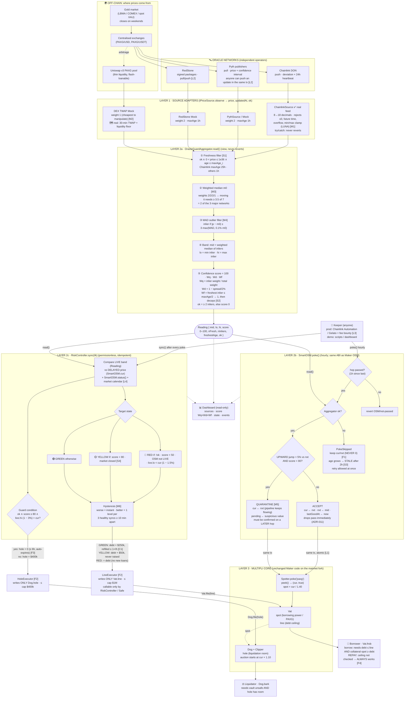

# OracleGuard, end to end: how the data flows and how it solves the 4 oracle problems

> **Who this is for:** judges, mentors, and anyone who needs the whole system in one sitting.
> **How to read it:** §1 is the one-minute version. §2 is the full data-flow diagram. §3 follows one gold price through every stage. §4 takes each of the **4 problems** in turn: what goes wrong → how our system stops it → the proof. §5 covers the real-world answers to **latency** and **manipulation**.
> Every number here comes from the contracts in `contracts/src/` and our fork tests. Anything **not built yet** is marked 🗺️ *roadmap*.
> Companion docs: `FLOW_EXPLAINED.md` (the original stage-by-stage walkthrough), `review.md` (score definition + validation), `PROBLEMS_AND_SOLUTIONS.md` (plain language).

---

## 1. The one-minute version

**The setting.** rwaUSD is a stablecoin. You lock **PAXG** (tokenised gold) in a vault and borrow rwaUSD against it. To decide *how much* you may borrow and *when* your vault gets liquidated, the protocol needs the **price of gold**. Today that price comes from **one** Chainlink feed, passed through Maker's **OSM** (a 1-hour delay box).

**The 4 problems we solve:**

| # | Problem | In one sentence |
|---|---|---|
| **P1** | **Single-block manipulation** | Someone moves one price source for one block (flash loan, thin pool, a well-timed poke) and the protocol believes it. |
| **P2** | **Staleness and RWA false positives** | Old prices are trusted forever. But a naive "too old → stop" rule would *also* be wrong: gold feeds are quiet by design, and RWA markets close on weekends. |
| **P3** | **Correlated failures** | Several sources are wrong *at the same time* (Mango Markets), or they all move together for real (a crash), and the system must tell these apart. |
| **P4** | **Binary, all-or-nothing freezes** | The legacy oracle has two modes, *trust blindly* or *price = 0*, and price = 0 liquidates everyone. |

**Our answer, OracleGuard, is three layers with one idea: graduated trust.**
1. **Aggregator:** ask 4 independent oracles, take a **weighted median**, reject outliers, and output a price **plus a confidence score from 0 to 100**.
2. **SmartOSM:** a drop-in replacement for Maker's OSM. It keeps the 1-hour safety delay, **never outputs 0**, reports its own age, and **holds back suspicious price rises**.
3. **RiskController:** a traffic light (🟢 GREEN / 🟡 YELLOW / 🔴 RED + a 🛡️ liquidation guard). It only ever moves **two numbers**: the **debt ceiling** (`Vat.line`) and the **liquidation limit** (`Dog.hole`), each through a tiny capped "executor".

> **One line for the judges:** *"The old oracle can only say 'here's the price' or 'the price is zero'. OracleGuard says 'here's the price, and here's how sure I am', then tightens borrowing step by step. It never blocks repayments and never crashes the price to zero."*

---

## 2. The full data-flow diagram

### 2.1 Detailed diagram (renders on GitHub)
Tags in the boxes point to the defences in §4 and §5: **[M#]** = manipulation defence, **[L#]** = latency defence, **[S#]** = staleness defence, **[C#]** = correlated-failure defence, **[F#]** = freeze-prevention (graduated response).



### 2.2 The same diagram in plain text (for slides and terminals)

```
╔══════════════════════════ OFF-CHAIN WORLD ═══════════════════════════════════════════════╗
║  Gold market (closes weekends) ──► CEXs ──► Chainlink DON · Pyth publishers · RedStone     ║
║                                     └─arb─► Uniswap v3 PAXG pool (thin, flash-loanable)    ║
╚═══════════════╤═══════════════╤═══════════════╤═══════════════════╤════════════════════════╝
                │ push (dev/24h)│ pull [L2]     │ signed pkgs [L2]  │ on-chain
                ▼               ▼               ▼                   ▼
┌─ LAYER 1 · SOURCES  observe() → {price WAD, updatedAt, ok}   never revert (try/catch) ─────┐
│ ChainlinkSource (REAL) │ Pyth (w2, 1h)      │ RedStone (w2, 1h)  │ DEX TWAP (w1, 1h) [M2]   │
│ w2, maxAge 25h         │                    │                    │ lowest weight: cheapest  │
│ rejects clamp/≤0 [M1]  │                    │                    │ to manipulate            │
└───────────┬────────────┴─────────┬──────────┴─────────┬──────────┴───────────┬──────────────┘
            └──────────────────────┴────────┬───────────┴──────────────────────┘
                                            ▼  ×4
┌─ LAYER 2a · AGGREGATOR  read()  (view) ───────────────────────────────────────────────────┐
│ ① fresh?  ok ∧ age ≤ maxAge_i                                                  [S1]      │
│ ② m0 = weighted median   (needs ≥ ½ of weight = 2 of 3 majors to move)         [M3]      │
│ ③ outliers out: |p − m0| > 3·max(MAD, 0.1%)                                    [M4]      │
│ ④ mid, lo, hi of inliers                                                                 │
│ ⑤ score = 100 · Wq(coverage) · Wd(agreement) · Wf(freshest inlier)             [S2]      │
│    ok = ≥ 2 inliers                                                                      │
└───────────────┬─────────────────────────────────────────────┬────────────────────────────┘
                │ Reading (hourly, via poke)                  │ Reading (every sync)
                ▼                                             ▼
┌─ LAYER 2b · SMART OSM  poke() ──────────┐     ┌─ LAYER 2c · RISK CONTROLLER  sync() ──────┐
│ 1h passed? no → revert                  │     │ LIVE band vs DELAYED cur + OSM status      │
│ !ok → SKIP: keep price (never 0) [F1]   │cur, │ + calendar [L4][S4]                        │
│        age grows → STALE >2h     [S3]   │status│                                           │
│ rise >5% ∧ score<80 → QUARANTINE [M5]   ├────►│ RED    !ok · score<50 · OSM≠LIVE ·         │
│        cur ← nxt, hold new value        │     │        live.lo < cur − 1.5%                │
│ else ACCEPT: cur ← nxt, nxt ← mid       │     │ YELLOW score<80 · market closed            │
│ (drops pass instantly: ADR-011)         │     │ GREEN  otherwise                           │
│ ─► Spotter.poke() same tx        [L1]   │     │ hysteresis: down now, up slowly  [M6]      │
└───────────────┬─────────────────────────┘     │ GUARD  score≥80 ∧ live.hi −3% > cur        │
                │ peek() = (cur, true)          └───────┬──────────────────────┬─────────────┘
                ▼                                       │ setLine              │ setHole
┌─ LAYER 3 · MULTIPLI CORE (unchanged) ───────┐   ┌─────▼──────────┐    ┌──────▼─────────┐
│ Spotter: spot = cur / 1.40                  │   │ LineExecutor   │    │ HoleExecutor   │
│ Vat: spot · line ◄──────────────────────────┼───│ Vat.line ≤ $1M │    │ Dog.hole ≤$400k│
│ Dog/Clipper: hole ◄─────────────────────────┼───┼────────────────┼────│ [F2] one number│
└──────────┬──────────────────────┬───────────┘   └────────────────┘    └────────────────┘
           ▼                      ▼                 GREEN  line = debt + $250k, ≤ 1 refill/h [C1]
  👤 Borrower (Vat.frob)    ⚖️ Liquidator (Dog.bark)  YELLOW line = debt + $50k (fixed)
  borrow: ≤ line ∧ safe      unsafe ∧ hole room      RED    line = debt  (repay still works [F4])
  repay: ALWAYS works [F4]                           GUARD  hole = 0 for ≤ 6h [F3]

  🤖 Keeper (anyone; prod: Automation/Gelato + bounty [L3]) calls poke() hourly, then sync().
```

### 2.3 Two "clocks" in the system (the key to understanding latency)
| Path | Speed | Why |
|---|---|---|
| **Borrowing decisions** (RiskController reads the **live** band) | **Instant**: every `sync()` | If the market is already below the price the Vat uses, we stop new loans *now*, not in an hour. |
| **Collateral price in the Vat** (SmartOSM `cur`) | **1-hour delay** (`hop`) | A manipulated price can't reach liquidations for at least an hour, so there's time to react. |

That split is how we get **low latency where speed protects the protocol** (freezing new debt) and **a deliberate delay where speed would help an attacker** (liquidation prices).

---

## 3. Following one gold price from start to finish

**Starting state (real fork, block 26,011,000):** PAXG ≈ **$4,372.48**, ilk debt ≈ **$43,029**, debt ceiling cap $1,000,000, liquidation ratio `mat` = 1.40.

### Step 0: One-time installation (the "spell")
1. **Deploy** 4 sources, the Aggregator (weights 2/2/2/1), SmartOSM (`init` at the legacy OSM's current price, so there is **no price jump**), two executors (caps $1M and $400k), and the RiskController.
2. **Spell**, executed as Multipli's admin Safe:
   - `Spotter.file("paxg","pip", SmartOSM)`: the Spotter now reads from SmartOSM.
   - `Vat.rely(LineExecutor)` and `Dog.rely(HoleExecutor)`: the only two new permissions on Multipli's core.
   - first `poke` + `sync`.
3. **Result:** 🟢 GREEN, score 100, `Vat.line` = $43,029 + $250,000 = **$293,029**. **Zero lines of Multipli code changed. Rollback = one transaction.**

### Step 1: Sources report (Layer 1)
| Source | Price | Age | Weight | Max age | Fresh? |
|---|---|---|---|---|---|
| Chainlink (real) | $4,372.5 | 18h | 2 | 25h | ✅ quiet but normal for a deviation feed |
| Pyth | $4,372.0 | 1 min | 2 | 1h | ✅ |
| RedStone | $4,373.0 | 1 min | 2 | 1h | ✅ |
| DEX TWAP | $4,371.0 | 1 min | 1 | 1h | ✅ |

Every adapter wraps its external call in `try/catch`. A broken oracle returns `ok = false`; it never crashes anything downstream.

### Step 2: Aggregation (Layer 2a)
- Sort by price: DEX 4,371.0 (cum. weight 1) → Pyth 4,372.0 (3) → **Chainlink 4,372.5 (5 ≥ 3.5)** → RedStone 4,373.0 (7). So **m0 = $4,372.5**.
- Deviations from m0 are [0, 0.5, 0.5, 1.5], so MAD = 0.5. The floor is 0.1% × m0 = $4.37, giving a threshold of 3 × 4.37 = **$13.12**. All four are **inliers**.
- **mid = $4,372.5**, lo = $4,371.0, hi = $4,373.0.
- **Score:** Wq = 7/7 = 1.00 · Wd = 1 − (0.046% / 2%) = 0.98 · Wf = 1.00 (freshest is 1 min old) → **98**.

### Step 3: Delayed price (Layer 2b)
The keeper calls `SmartOSM.poke()`. An hour has passed, the reading is ok, and it's not a suspicious rise, so it's **ACCEPTED**:
`cur ← nxt` (the price vetted an hour ago), `nxt ← $4,372.5`. In the **same transaction**, `Spotter.poke()` sets `spot = 4,372.5 / 1.40 = $3,123.2` of borrowing power per PAXG.

### Step 4: Risk decision (Layer 2c)
The keeper calls `RiskController.sync("paxg")`. Score 98 ≥ 80, SmartOSM is LIVE, and live.lo ($4,371) is not below cur × 0.985, so the target is **🟢 GREEN**. The guard stays OFF because the live high isn't 3% above cur.
→ `LineExecutor.setLine(debt + $250k)` at most once per hour.

### Step 5: What users can do (Layer 3, unchanged Maker code)
- **Borrower** with 10 PAXG: may borrow up to 10 × $3,123 = **$31,231**, if the hourly headroom allows. **Repaying always works.**
- **Liquidator:** may liquidate a vault only if it is really unsafe at `spot` **and** `Dog.hole` has room.

---

## 4. The four problems, one by one

Each section follows the same pattern: **what goes wrong → what the legacy system does → our layered defences → proof.**

---

### P1. Single-block manipulation

#### What goes wrong
An attacker needs the protocol to believe a wrong price for **one moment**:
- **Flash-loan pump:** borrow a huge amount inside one transaction, dump it into the thin PAXG/USDC pool so the DEX spot price jumps, and let the oracle read it. Repay the loan in the same block.
- **Compromised single feed:** one oracle (or its operator key) reports a bad value for one round.
- **Poke timing:** `poke()` is public, so an attacker can call it at the exact block where a price is most favourable to them.
- **Sync spam:** calling the controller many times in one block to flip it back to GREEN.

**Legacy rwaUSD:** a single feed is the price. **Proof on the fork (S3):** we swapped in a feed saying gold was 10× higher. With **$43,724** of PAXG we borrowed **$312,319**, leaving **$268,595 of bad debt**.

#### Our defences: 6 walls an attacker must break *in the same hour*
| Wall | Where | What it does to a one-block attack |
|---|---|---|
| **[M1] Sanity checks in the adapter** | `ChainlinkSource` | Rejects ≤ 0, future timestamps, overflow values, and values stuck on the feed's min/max clamp (the LUNA failure). |
| **[M2] Weight by cost of manipulation** | Aggregator config | The DEX, the only source a flash loan can move, has weight **1 of 7**. It is a sanity check, not a price setter. |
| **[M3] Weighted median** | Aggregator ② | Moving the median needs **≥ 3.5 of 7** weight, i.e. **2 of the 3 major networks lying in the same direction**. One source, or even DEX + one major (3/7), can't do it. |
| **[M4] MAD outlier rejection** | Aggregator ③ | A value far from the others is thrown out entirely, and the score drops by its weight share so the system *notices*. |
| **[M5] Asymmetric jump quarantine** | SmartOSM | A rise of **> 5%** with **score < 80** is held back and only accepted if a **later hour** still shows it. A one-block pump can't survive an hour. |
| **1-hour delay** (`hop`) | SmartOSM `nxt → cur` | Even an accepted price only reaches the Vat **one hour later**. A single block never reaches liquidations directly. |
| **[C1] Rate limit** | RiskController GREEN | Even if everything above failed, new debt is capped at **$250k per hour**. |
| **[M6] Hysteresis** | RiskController | Getting worse is instant. Getting better needs **3 healthy syncs at least 10 minutes apart**, so spamming `sync()` in one block can't unlock borrowing. |

#### Worked example: flash-loan pump of the DEX to 10×
| | Chainlink | Pyth | RedStone | DEX |
|---|---|---|---|---|
| Price | $4,372.5 | $4,372.0 | $4,373.0 | **$43,720** |

- Weighted median: Pyth (cum. 2) → Chainlink (cum. 4 ≥ 3.5), so **m0 = $4,372.5**. The attacker's number sits at the far end and can't reach the middle.
- MAD = 0.5 → threshold $13.12 → **DEX is an outlier**.
- mid stays **$4,372.5**. Wq = 6/7 → **score ≈ 84 → still GREEN**. A thin-pool glitch shouldn't punish honest users, but the dashboard shows it.

#### Proof
- **S3 (fork test):** $268,595 bad debt before → **$0** after. The compromised Chainlink is an outlier, and max draw ($31,231) stays below collateral value ($43,724).
- **Incident replay:** Synthetix sKRW 1000× (I1), Compound DAI (I2), Pyth BTC publisher error (I3): **0 dangerous hours** under OracleGuard.
- **Monte-Carlo (Varun, `research/RESULTS.md`):** single-source faults (k = 1) give **0% false negatives** for every fault type (spike, drift, freeze, clamp, delay).

---

### P2. Staleness and RWA false positives

This problem has **two sides**, and a good oracle must get both right.

#### Side A: the price is old, but the system keeps trusting it
- Chainlink's adapter correctly says "too old" after 24h, but the legacy **OSM ignores that flag** and keeps serving the last price as valid **forever**.
- **Proof (S1):** a **186-hour-old** price (almost 8 days) still let us mint **31,231 rwaUSD**.

#### Side B: a naive staleness rule creates false alarms (false positives)
If we simply said "older than 1 hour → stop lending", the system would be broken most of the time, because RWA prices are **quiet by design**:
- **Chainlink PAXG/USD is a deviation feed.** It only updates when the price moves enough, or once every ~24h. At our fork block the "fresh" round was already **16.5 hours old**, and that's **normal**.
- **Real-world markets close.** Gold spot trades roughly 24/5; stock markets close nights, weekends and holidays. Tokenised versions (PAXG, TSLAx) trade on-chain 24/7, so on-chain prices drift while the real market is shut. "No new data" does not mean "broken".
- A false positive **costs real users**: frozen borrowing on a quiet Sunday makes the stablecoin unusable.

#### Our defences
| Defence | Where | How it balances both sides |
|---|---|---|
| **[S1] Per-source max age** | Aggregator ① | Each source has its own `maxAge`: **25h** for the Chainlink deviation feed (quiet ≠ broken), **1h** for fast pull oracles. A source past its limit is dropped. |
| **[S2] Freshness from the *freshest* agreeing source** (ADR-009) | Aggregator ⑤ `Wf` | Confidence decays only when even the **newest** agreeing source is getting old. One slow feed lowers coverage (`Wq`), not the whole score. Without this, the real Chainlink age gave score ≈ 34 → RED at t = 0. |
| **Graduated penalty** | Score → state | **1 major source stale → Wq 5/7 → score 71 → 🟡 YELLOW** (borrowing capped at $50k, not frozen). **2 stale → 42 → 🔴 RED.** **All stale → ok = false → 🔴 RED.** |
| **[S3] SmartOSM knows its own age** | `lastGoodAt`, `age()`, `status()` | No accepted update for **> 2h** → `status = STALE` → RiskController goes RED on the next sync. Staleness is no longer silent. |
| **Never 0 on staleness** | SmartOSM skip | If sources die, the last good price is **kept** (never zeroed), and the RED state blocks new debt instead. |
| **[S4] Market-hours calendar** | `SessionCalendar` + RiskController | When the underlying market is **closed**, the state is capped at **🟡 YELLOW, not RED**: cautious, not frozen. Hourly week mask + holiday list; if the calendar breaks it defaults to YELLOW. (PAXG is 24/7 in the MVP; tokenised stocks such as TSLAx use a NYSE mask.) |
| **Slow re-opening** | Hysteresis | After a closed period or an outage, borrowing comes back **one level at a time** (≥ 3 spaced healthy checks), which avoids "Monday-open gap" over-borrowing. |
| **Rise-only quarantine** (ADR-011) | SmartOSM | We found that holding back *all* big moves froze the price during real crashes. Now only suspicious **rises** wait, so honest drops always flow through. |

#### How much each stale source "costs"
| Sources lost (stale / broken / outlier) | Wq | Score (rest agree) | State | User impact |
|---|---|---|---|---|
| none | 7/7 | 100 | 🟢 | $250k/h |
| DEX only | 6/7 | 85 | 🟢 | $250k/h |
| one of Chainlink / Pyth / RedStone | 5/7 | 71 | 🟡 | $50k total |
| one major + DEX | 4/7 | 57 | 🟡 | $50k total |
| two majors | 3/7 | 42 | 🔴 | no new loans, repay OK |
| fewer than 2 left | n/a | 0 | 🔴 | no new loans, repay OK, price kept |

#### Proof
- **S1 on the fork:** one source stale → YELLOW, new debt capped at $50k; all stale → RED, **mint reverts, repay works, price never 0**.
- **Replay I5 (stale outage 1 → all):** mint false negatives **4 → 0**.
- **User cost, measured honestly:** across 55 replayed incident hours, OracleGuard spent **7 hours in RED while the price was actually fine**, all of them right after real crashes, where slow recovery is deliberate. Single-source faults cost only YELLOW hours (borrowing capped, never frozen).

---

### P3. Correlated failures

"Correlated" means **several sources go wrong, or move, at the same time**. There are two very different cases, and the system must handle **both**:

| Case | Example | The right reaction |
|---|---|---|
| **3a. Correlated *wrong*** | **Mango Markets (2022):** every oracle tracked a manipulated spot market. **PAXG dislocation:** all PAXG feeds agree, but the token drifts from real gold. | Don't let it drain the protocol. |
| **3b. Correlated *true*** | **USDC/SVB depeg (2023)**, **Black Thursday (2020)**: the market really crashed and every source agreed. | **Do not block liquidations**, or bad debt piles up. |

#### Honest statement (say this to judges first)
> **No median-based oracle can *detect* 3a**, and that includes Chainlink's own network. If most sources agree on a wrong number, consensus says it's right. So our goal for 3a is **bounded loss**, not detection. For 3b our goal is **zero false alarms on liquidations**.

#### Our defences for 3a (correlated wrong): make it expensive and bounded
| Defence | Effect |
|---|---|
| **Independent networks** (Chainlink DON, Pyth publishers, RedStone signers, on-chain DEX) | Different operators, keys and delivery paths. An attacker must corrupt **2 of the 3 majors** (≥ 3.5/7 weight). |
| **Global underlying market** | PAXG tracks a gold market worth roughly $15T. Moving every venue is far harder than moving Mango's illiquid MNGO. |
| **Quarantine + 1h delay** | A sudden correlated pump with any disagreement waits an hour; even agreed prices take an hour to reach the Vat. |
| **[C1] Rate-limited headroom (the key bound)** | Even in GREEN, new debt ≤ **$250k per hour**. So `MaxLoss ≤ $250k × hours undetected`, instead of the **≈ $957k** whole remaining ceiling in one go. |
| 🗺️ **Fundamental anchor** (roadmap) | An *uncorrelated* source: XAU spot × PAXG's fixed troy-ounce ratio. It catches "all PAXG feeds agree but PAXG ≠ gold" (I9). |
| 🗺️ **Proof-of-Reserve gating** (roadmap) | Mint only while Paxos's gold reserves are attested. |

#### Our defences for 3b (correlated true): don't get in the way
| Design choice | Why it matters in a real crash |
|---|---|
| **RED never blocks liquidations** | RED only freezes **new borrowing** (`Vat.line`). `Dog.hole` is untouched by RED. |
| **Drops pass SmartOSM immediately** (ADR-011) | Our replay showed a symmetric quarantine froze the price for 4h during Black Thursday. Fixed: extra liquidation lag **4h → 0h**. |
| **The guard only fires in the *other* direction** | The liquidation guard needs the live market **above** the delayed price (vaults safer than they look). In a crash the market is *below*, so the guard can't arm. |
| **Guard needs broad agreement and expires** | Needs score ≥ 80 and auto-expires after **6h**, so a fooled guard can't hold liquidations for long. |

#### Proof (on-chain replay of 8 real incidents, `contracts/test/replay/Incidents.t.sol`)
| | Legacy rwaUSD | OracleGuard |
|---|---|---|
| Hours where a wrong price allowed over-borrowing | **21** | **2** (both Mango, the declared limit) |
| Hours where a healthy vault could be liquidated unfairly | **5** | **1** |
| Guard wrongly pausing needed liquidations in *real* crashes (I4, I7, I8) | n/a | **0** |
| Worst-case new debt at a wrong price | **≈ $956,970 at once** | **≤ $250,000 per hour** |

Monte-Carlo: with **k = 1** faulty source, false negatives are **0%**. With **k ≥ 3** faulty spikes, that's the declared correlated limit, and the rate limit bounds the loss.

---

### P4. Binary, all-or-nothing freezes

#### What goes wrong
The legacy oracle has **two modes and nothing in between**:
1. **Trust blindly.** The OSM keeps `has = true` forever, even on a stale price.
2. **Self-destruct.** The only emergency lever, `OSM.void()`, sets the price to **0**. The Spotter then sets `spot = 0`, so **every vault becomes liquidatable at once**.

Because option 2 is catastrophic, nobody would ever use it, which means that **in practice there is no safe reaction** to a doubtful price. Many protocols' "pause everything" buttons have a similar flaw: they also block repayments and liquidations, the two actions that make the system *safer*.

#### Our defences: a dial instead of a switch
| Defence | Where | What it guarantees |
|---|---|---|
| **[F1] Zero-price invariant** (ADR-004) | SmartOSM | After `init`, `peek()` **always** returns `(price > 0, true)`. `void()` keeps its ABI but **reverts**. When data dies the last good price is kept and the *controller* reacts instead. |
| **Graduated states** | RiskController | 🟢 $250k/h → 🟡 $50k total → 🔴 no new debt. Each step only restricts **new** debt. |
| **Only two levers** | RiskController | `Vat.line` (new borrowing) and `Dog.hole` (new liquidations). **Never** the price, **never** `Spotter.mat` (raising it would liquidate people mid-incident: ADR-001), never fees. |
| **[F4] Repayments always work** | Maker's own Vat logic | The Vat checks the ceiling **only when debt increases**. Repay, add collateral and close vault work in every state. |
| **[F2] Bounded executors** | LineExecutor / HoleExecutor | Each writes **one number**, never above the governance cap, callable only by the controller. A buggy controller can at worst be *too careful*: it can never mint, move the price, or seize collateral. |
| **[F3] Time-boxed liquidation guard** (ADR-008) | RiskController | Pauses only **new** liquidations (running auctions continue), needs score ≥ 80, and **auto-expires after 6h**. After expiry it can't re-arm until the condition clears once. |
| **Hysteresis** (ADR-006) | RiskController | Instant downgrade, slow upgrade: no flapping between states. |
| **One-transaction install and rollback** | Spell | Governance can switch back to the legacy OSM in one call. |

#### Legacy vs OracleGuard, action by action
| User action | Legacy normal | Legacy `void()` | 🟢 GREEN | 🟡 YELLOW | 🔴 RED | 🛡️ Guard |
|---|---|---|---|---|---|---|
| Deposit collateral | ✅ | ✅ | ✅ | ✅ | ✅ | ✅ |
| Borrow new rwaUSD | ✅ unlimited to $1M | ❌ | ✅ ≤ $250k/h | ⚠️ ≤ $50k | ❌ | per state |
| **Repay** | ✅ | ✅ | ✅ | ✅ | ✅ | ✅ |
| Withdraw (vault stays safe) | ✅ | ❌ | ✅ | ✅ | ✅ | ✅ |
| Liquidate unsafe vaults | ✅ | 💥 **everyone** | ✅ | ✅ | ✅ | ⏸️ new ones paused ≤ 6h |

#### Proof
- **S4 (captured dip):** legacy liquidated a **healthy 145% vault** (10 PAXG seized + 5% penalty). OracleGuard: guard ON → `Dog/liquidation-limit-hit` → **0 unjust liquidations**, released after one hop.
- **S2 (market −8% while the OSM lags):** RED immediately on borrowing; **liquidations stay ON**.
- **Invariant tests:** `peek()` never returns 0; repay never reverts because of OracleGuard.

---

## 5. Real-world solutions to latency and manipulation

This section answers *"how would this hold up in production, not just in a demo?"* ✅ = built and tested, 🟨 = partly built, 🗺️ = designed (roadmap).

### 5.1 Latency: "the price arrives too late"

**Where latency comes from today:**
1. **Push feeds are slow on purpose.** Chainlink PAXG/USD updates on a deviation threshold or a ~24h heartbeat (the round was 16.5h old at our fork block).
2. **The OSM adds a 1-hour delay** (on purpose, against manipulation).
3. **Two-step propagation:** legacy needs `OSM.poke()` **and then** a separate `Spotter.poke()`, and nobody is paid to call either.
4. **Keeper risk:** if nobody calls poke, the price silently ages.

| # | Solution | Status | How it cuts latency |
|---|---|---|---|
| **[L1]** | **Atomic propagation** | ✅ | `SmartOSM.poke()` calls `Spotter.poke()` in the **same transaction**. One step instead of two: the Vat updates the moment the OSM does. |
| **[L2]** | **Pull oracles (Pyth, RedStone)** | 🟨 interface + mocks built; Varun's real `PythSource` plugs into the same slot | Anyone (a user, a keeper, a liquidator) can post a **fresh signed price in the same transaction** that uses it. Latency drops from "hours" to "seconds", and the protocol no longer depends on a push schedule. |
| **[L4]** | **Split clocks: live band for borrowing, delayed price for liquidations** | ✅ | The RiskController reads the **live** band on every `sync()`. If the market drops below the Vat's price by > 1.5%, borrowing is **frozen immediately**, with no 1-hour wait. The delay only stays where it protects users (liquidations). |
| **[L3]** | **Paid keepers** | 🗺️ | Chainlink Automation / Gelato call `poke()` hourly and `sync()` right after, funded by a small **bounty from stability fees**. Both functions are **permissionless**, so any backup keeper (or a user) can step in. |
| — | **Fail-safe if keepers stop** | ✅ | No poke → SmartOSM `age()` grows → STALE after 2h → RED on the next sync. Missing keepers make the system **more careful**, never looser. |
| — | **Per-asset hop and freshness** | ✅ configurable | `hop`, `staleLimit` and each source's `maxAge` are set per asset: gold can use 1h, a volatile equity a shorter hop. Delay risk ≈ 4·σ·√delay: about 0.9% for gold over 2h, so 1h is safe for PAXG. |
| — | **Low-latency data products** | 🗺️ | Chainlink Data Streams / Pyth Lazer-style sub-second feeds as extra `IPriceSource` adapters. No other contract changes, because the interface is fixed. |
| — | **L2 deployments** | 🗺️ | On Base / Ink / Monad (where rwaUSD also lives), add a **sequencer-uptime** check: sequencer down → treat as stale → RED. |

### 5.2 Manipulation: "someone fakes the price"

**The attacker's menu:** flash-loan a thin DEX pool · corrupt or bribe one oracle · time a public `poke()` · spam `sync()` · take over admin keys and swap the oracle · move every market at once (Mango-style).

| # | Solution | Status | What it defeats |
|---|---|---|---|
| **[M1]** | **Adapter sanity checks** (≤ 0, future timestamp, overflow, min/max clamp) | ✅ | Garbage values and the LUNA "stuck at floor" failure. |
| **[M2]** | **Weight by cost of manipulation**: DEX = 1/7; majors = 2/7 each | ✅ | Flash loans: the only flash-loanable source can't move the price. |
| — | **TWAP instead of spot + liquidity floor** for the DEX source | 🗺️ (mock today) | A one-block (12s) +50% pump shifts a 30-minute TWAP by only 50% × 12/1800 ≈ **0.3%**. Below a minimum pool liquidity the DEX source reports `ok = false`. |
| **[M3]** | **Weighted median** across independent networks | ✅ | Any single corrupted oracle; it needs 2 of the 3 majors. |
| **[M4]** | **MAD outlier rejection** | ✅ | Extreme values are excluded **and** lower the score, so an attack is visible. |
| **[M5]** | **Asymmetric jump quarantine** (> 5% rise, score < 80 → wait for the next hour) | ✅ | One-block and short-lived pumps; poke-timing attacks on a rising price. |
| — | **1-hour delay** (OSM `nxt → cur`) | ✅ | Nothing reaches liquidation prices within the same hour. |
| **[M6]** | **Hysteresis** (3 healthy syncs ≥ 10 min apart to upgrade) | ✅ | `sync()` spam and same-block flip-backs. |
| **[C1]** | **Rate-limited borrowing** ($250k/h in GREEN) | ✅ | Everything that slips through: **loss is bounded by time**. |
| — | **Pull-oracle confidence intervals** | 🗺️ | Pyth publishes a confidence band. A wide band can lower that source's weight or mark it `ok = false`. |
| — | **Round-TWAP poke** | 🗺️ | `nxt` = average of all Chainlink rounds in the hop, so there's **no single block worth timing**. |
| — | **Challenge window** | 🗺️ | During the hop, anyone can void a pending `nxt` by submitting **on-chain-verifiable signed prices** (Pyth VAA / EIP-712 quorum) that contradict it. |
| — | **Governance hardening** (our finding V5) | 🗺️ recommended to Multipli | Today 4-of-8 Safe signers can swap the oracle **instantly**. Fix: a **48h timelock** on oracle config plus a "tighten-only" guardian that can make the system *more* careful but never looser. |
| — | **Fundamental anchor + Proof-of-Reserve** | 🗺️ | Catches correlated manipulation of *all* PAXG feeds by checking against real gold (XAU × ratio) and Paxos's reserves. |

### 5.3 How the defences stack (a timeline of an attack)
```
t = 0      attacker pumps DEX via flash loan ──► [M2] weight 1/7 · [M4] outlier → IGNORED
t = 0      attacker also corrupts ONE major    ──► [M3] median unmoved · score drops → 🟡 YELLOW ($50k cap)
t = 0      attacker spams sync() to go GREEN   ──► [M6] needs 3 syncs ≥ 10 min apart → still YELLOW
t = 0      attacker corrupts TWO majors (+20%) ──► [M5] rise > 5% with low agreement → QUARANTINED
t = +1h    rise still there? must also pass     ──► 1h delay before cur; RED while quarantined
t = +2h    worst case: fully accepted          ──► [C1] ≤ $250k new debt per hour; the dashboard shows it
                                                   MaxLoss ≤ $250k × hours-until-humans-react
legacy:    one feed, no checks                 ──► ≈ $957k (whole ceiling) in ONE transaction
```

---

## 6. When things break: every failure and where it's caught
| Failure | Caught by | Outcome |
|---|---|---|
| An oracle reverts / returns garbage | adapter `try/catch`, price cap | Ignored; score −(its weight share) |
| An oracle lies (spike or crash) | Aggregator MAD | Outlier; price unchanged |
| An oracle goes stale | Aggregator max age | Dropped; YELLOW if it's a major source |
| All oracles stale | SmartOSM skip + STALE | Last price kept (never 0), RED, repay works |
| The Aggregator itself reverts | SmartOSM `try/catch` | `PokeSkipped`; age grows → STALE → RED |
| Low-agreement price rise | SmartOSM quarantine | Held back one hour; RED meanwhile |
| Real crash, one oracle lagging | Drops pass; laggard dropped | Vat follows within the design delay; borrowing RED; liquidations run |
| Brief dip captured by the delayed price | Liquidation guard | New liquidations paused ≤ 6h |
| 2+ major oracles wrong together | ❌ not detectable | **Bounded**: ≤ $250k/h vs ≈ $957k at once |
| Market closed (RWA) | SessionCalendar | YELLOW, not RED |
| Nobody calls poke/sync | age → STALE | Fails safe (RED on the next sync) |
| Controller bug | Executor caps | At worst: lower ceiling or paused new liquidations |
| Governance wants out | `Spell.rollback()` | Back to the legacy OSM in one transaction |

---

## 7. What we don't fully solve (say it before they ask)
1. **Correlated manipulation of most sources** (Mango-class) can't be *detected* by any consensus oracle. We **bound** it ($250k/h) and make it **expensive** (2 of 3 independent networks on a global market).
2. **3 of 4 sources are simulated** in the demo, so we can stage attacks. Chainlink is the real mainnet feed on the fork, and real sources plug into the same interface.
3. **One `spot` per collateral type** in a Maker Vat: we can't have separate borrow and liquidation prices without a v2 Vat. We get the asymmetric *behaviour* through `line` vs `hole`.
4. **Parameters** ($250k/h, 80/50 thresholds, 1.5% / 3% gaps, 6h guard) are reasoned defaults, validated on 8 incident replays, not yet calibrated on years of data.
5. **Admin-key risk** needs Multipli to add a timelock; code can only recommend it.
6. **Gas:** `SmartOSM.poke` costs about 100–150k gas vs about 40k for the legacy poke. That's small at one poke per hour.

---

## 8. The 30-second pitch version of this whole document
1. **Four oracles, weighted median, outliers out.** No single source (and no flash loan) can move the price. → **P1**
2. **A confidence score (0–100)** from coverage × agreement × freshness, with per-source max ages and a market calendar, so quiet RWA feeds aren't false alarms but truly stale ones are caught. → **P2**
3. **Correlated wrong prices can't be detected by anyone, so we bound them:** at most $250k/h instead of ≈ $957k at once. Correlated *true* crashes still liquidate on time. → **P3**
4. **A dial, not a switch:** GREEN / YELLOW / RED only restrict **new** debt. The price is never zero, repayments always work, and the liquidation pause is time-boxed. → **P4**
5. **Drop-in:** one governance spell, no core code changed, proven on a fork of the real rwaUSD contracts: **$268,595 bad debt → $0**, over-borrowing hours **21 → 2**.
