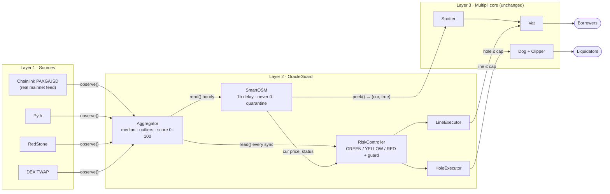
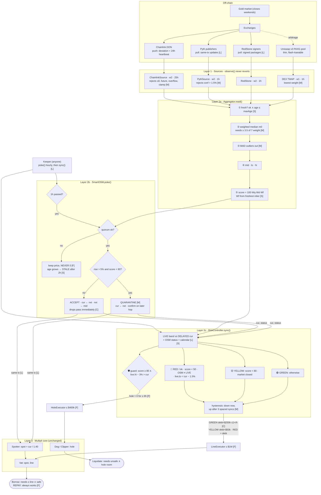

# OracleGuard: graduated-trust oracles for Multipli's rwaUSD

**Multipli Hackathon 2026 · "Rethinking Blockchain Oracles"** · Team: R Varun · Kapilan · Jeffrey Winson (VIT Vellore)

OracleGuard is an oracle safety layer for **rwaUSD**, Multipli's Maker-fork CDP stablecoin backed by tokenised gold (**PAXG**). It replaces a single-feed, binary oracle with one that reports **a price *and* how sure it is (0–100)**, then tightens **new borrowing** step by step as that confidence falls. Repayments always work, and the price is never zero.

**It is built and attacked on the real protocol, not a mock-up.** Every test runs on an **Ethereum mainnet fork** (block 26,011,000) against Multipli's deployed `Vat`, `Spotter`, `Dog`, `Clipper` and OSM. We first prove the exploits succeed on today's contracts. Then we install OracleGuard with **one governance spell** (no core code changed, one-call rollback) and prove the same exploits fail.

| | Legacy rwaUSD (measured on the fork) | With OracleGuard |
|---|---|---|
| Feed compromised (price ×10) | **$268,595 bad debt** ($312,319 minted against $43,724 of gold) | **$0**: the bad source is rejected as an outlier |
| Feed stale for 186 hours | still mints 31,231 rwaUSD on an 8-day-old price | 🟡 capped at $50k → 🔴 no new debt; **repay still works** |
| Brief −15% dip captured by the 1h delay | healthy 145% vault liquidated | 🛡️ guard pauses *new* liquidations; **0 unjust liquidations** |
| Worst-case new debt at a wrong price | **≈ $956,970 in one transaction** | **≤ $250,000 per hour** (rate-limited) |
| 8 historical oracle incidents replayed hour by hour | 21 over-borrowing hours · 5 unfair-liquidation hours | **2** · **1** |

The two remaining over-borrowing hours are **Mango Markets**, where every oracle followed a manipulated market. No consensus-based oracle can detect that case, including Chainlink's own network. We say so up front, and **bound** the damage instead ([Limitations](#limitations)).

---

## Table of contents

1. [Problem statement](#problem-statement)
2. [Domain background](#domain-background)
3. [What we found in the live contracts](#what-we-found-in-the-live-contracts)
4. [Solution approach](#solution-approach)
5. [How it solves the four oracle problems](#how-it-solves-the-four-oracle-problems)
6. [Architecture](#architecture)
7. [Data flow](#data-flow)
8. [The confidence score](#the-confidence-score)
9. [What GREEN / YELLOW / RED actually change](#what-green--yellow--red-actually-change)
10. [Latency and manipulation: real-world solutions](#latency-and-manipulation-real-world-solutions)
11. [Code map](#code-map)
12. [Tech stack](#tech-stack)
13. [Setup and running](#setup-and-running)
14. [Demo scenarios](#demo-scenarios)
15. [Testing and validation](#testing-and-validation)
16. [Limitations](#limitations)
17. [Roadmap](#roadmap)
18. [Documentation](#documentation)
19. [Team](#team)

---

## Problem statement

Blockchains can't see the outside world, so every lending protocol depends on an **oracle** to tell it what collateral is worth. Oracles fail in five well-known ways: **latency** (the price arrives late), **manipulation** (someone fakes it), **stale data** (it stops updating), **source failure** (a feed breaks), and **insufficient data** (too few independent sources). The hackathon asks us to rethink oracle design for real-world assets, and specifically to fix rwaUSD's **OSM and price adapter**.

We reduce these to **four concrete problems** that a gold-backed stablecoin actually faces:

| # | Problem | Why it matters for rwaUSD |
|---|---|---|
| **P1** | **Single-block manipulation** | One flash loan, one bad feed round, or one well-timed public `poke()` is enough for a single-feed oracle to believe a wrong price. |
| **P2** | **Staleness *and* RWA false positives** | Old prices are trusted forever today. But a naive "too old → halt" rule is also wrong: gold feeds are quiet by design and real-world markets close on weekends, so it would freeze honest users constantly. |
| **P3** | **Correlated failures** | Several sources can be wrong *together* (Mango Markets), or move *together for real* (a crash). The system must bound the first case without blocking liquidations in the second. |
| **P4** | **Binary, all-or-nothing freezes** | The legacy oracle has two modes, *trust blindly* or *price = 0*. Price = 0 liquidates every vault, so in practice there is no safe reaction at all. |

## Domain background

- **CDP stablecoin.** A user locks collateral (PAXG) in a **vault** and borrows a stablecoin (rwaUSD) against it, like a loan against jewellery. If the collateral's value falls too far, the vault is **liquidated**: its collateral is auctioned to repay the debt.
- **Maker architecture** (which rwaUSD forks):
  - **`Vat`**: the core ledger; holds vaults, the debt ceiling `line`, and `spot` (borrowing power per unit of collateral).
  - **`Spotter`**: reads the price and writes `spot = price / mat` into the Vat. `mat` = 1.40, so each $1.40 of gold supports $1 of debt.
  - **`OSM` (Oracle Security Module)**: holds prices back for **one hour** (`cur` = in use now, `nxt` = next hour's), so a manipulated price can't hit liquidations instantly.
  - **`Dog` + `Clipper`**: start and run liquidation auctions. `Dog.hole` limits how much can be in auction at once.
- **PAXG.** Each token is backed by one fine troy ounce of LBMA gold held by Paxos. It trades 24/7 on-chain, while the gold market it tracks has opening hours.
- **Oracle types.** **Push** (Chainlink: the network writes on-chain on a deviation or heartbeat, so it's slow when prices are quiet), **pull** (Pyth, RedStone: anyone can submit a fresh signed price in the same transaction), and **on-chain** (DEX TWAP: cheapest to manipulate on thin RWA pools).
- **Units.** Maker units: WAD = 1e18, RAY = 1e27, RAD = 1e45. All OracleGuard prices are **USD per token in WAD**.

## What we found in the live contracts

We read the deployed contracts and reproduced each issue on a mainnet fork (full threat model V1–V13 in [`docs/PROBLEM.md`](docs/PROBLEM.md)):

| Finding | What happens today | Proven on the fork |
|---|---|---|
| **Stale forever** (V1) | `PriceFeedAdapter` returns `(price, false)` after 24h, but the OSM **ignores the flag** and serves the old price as valid indefinitely | 31,231 rwaUSD minted on a **186-hour-old** price (`Baseline_S1`) |
| **Only brake is self-destruct** (V4) | `OSM.void()` sets the price to 0 → `spot = 0` → every vault liquidatable | by code inspection; hence never usable |
| **Single source** (V2) | one feed decides everything | $268,595 bad debt with a ×10 feed (`Baseline_S3`) |
| **Captured wick** (V6) | a dip recorded at poke time stays in use for an hour after the market recovers | healthy 145% vault liquidated (`Baseline_S4`) |
| **Instant oracle swap** (V5) | 4-of-8 admin Safe can change the price source with **no timelock** | governance finding; recommendation only |
| **Slow, unincentivised updates** (V12) | Chainlink round **16.5h old** at our fork block; OSM and Spotter pokes are two separate unpaid steps | read from chain |

## Solution approach

**One idea: graduated trust.** Instead of *valid / zero*, the oracle reports *price + confidence*, and the protocol responds proportionally and **asymmetrically** (it restricts the risky direction and never the safe one).

Three layers, each answering one question:

1. **Aggregator: *"What is the price, and how sure are we?"***
   - Reads 4 independent sources: Chainlink (real), Pyth, RedStone, DEX TWAP.
   - Drops stale or broken ones, takes a **weighted median** (weights 2/2/2/1) and rejects **outliers** (MAD test).
   - Outputs `mid`, a `lo…hi` band and a **confidence score 0–100**.
2. **SmartOSM: *"Which price should the protocol act on right now?"***
   - A **drop-in replacement** for Maker's OSM with the same ABI, so `Spotter`, `Clipper` and `End` work unchanged.
   - Keeps the 1-hour delay, **never outputs 0**, reports its own age/status, and **quarantines suspicious upward jumps** until a later hour confirms them.
   - Pushes each new price to the Vat in the **same transaction**.
3. **RiskController: *"What should users be allowed to do?"***
   - Compares the **live** band with the **delayed** price and the score to pick 🟢 GREEN / 🟡 YELLOW / 🔴 RED, plus a 🛡️ liquidation guard.
   - Acts only through **two bounded executors** that each write one number: the debt ceiling `Vat.line` and the liquidation limit `Dog.hole`.

**Installation** is a single governance spell run by Multipli's admin Safe:
- `Spotter.file("paxg", "pip", SmartOSM)`,
- `Vat.rely(LineExecutor)`,
- `Dog.rely(HoleExecutor)`.

No Multipli contract is modified or redeployed. `Spell.rollback()` restores the legacy OSM in one transaction.

### Non-negotiable safety rules (enforced by tests)
1. **Zero-price invariant:** after `init`, `SmartOSM.peek()` always returns `(price > 0, true)`. `void()` reverts.
2. **Repayments always work:** controller actions only restrict *new* debt (`line`) or *new* liquidations (`hole`).
3. **Never change `Spotter.mat`:** in a Maker fork `mat` is also the liquidation ratio, so raising it would liquidate users mid-incident ([ADR-001](docs/DECISIONS.md)).
4. **Bounded authority:** each executor writes exactly one parameter, within `[0, cap]`, and is callable only by the controller.
5. **Sources never revert:** every external call is wrapped in `try/catch` and becomes `ok = false`.
6. **Drop-in ABI:** SmartOSM keeps the full Maker OSM interface.

## How it solves the four oracle problems

| Problem | Defences (layered) | Evidence |
|---|---|---|
| **P1 Single-block manipulation** | adapter sanity checks (≤0, future timestamp, overflow, Chainlink min/max clamp) → DEX weighted lowest (1/7) → weighted median needs **2 of 3 major networks** to move → MAD outlier rejection → **upward jumps > 5% with score < 80 quarantined** until a later hour → 1-hour delay → **$250k/h borrowing rate limit** → hysteresis (3 healthy syncs ≥ 10 min apart to upgrade, so `sync()` spam can't unlock borrowing) | S3: $268,595 → **$0**. Replays I1–I3 (single-source spikes): **0** dangerous hours. Monte-Carlo, one faulty source: **0%** false negatives for every fault type |
| **P2 Staleness + RWA false positives** | **per-source max age** (25h for the quiet Chainlink deviation feed, 1h for pull oracles) → freshness judged on the *freshest* agreeing source ([ADR-009](docs/DECISIONS.md)) → one stale source costs only its weight share (→ 🟡, not 🔴) → SmartOSM reports `age()` / `status()`, STALE after 2h → 🔴 → **SessionCalendar**: a closed market gives 🟡 (caution), not 🔴 (freeze) → slow re-opening via hysteresis | S1: 186h-old price → 🟡 $50k cap / 🔴 no new debt, repay works. Replay I5: over-borrowing hours 4 → **0** |
| **P3 Correlated failures** | *Wrong together:* bounded, not detected. 2-of-3 independent networks on a ~$15T gold market must be corrupted; quarantine + delay; **≤ $250k new debt per hour**. *True together (a crash):* RED never touches liquidations, **drops pass SmartOSM immediately** ([ADR-011](docs/DECISIONS.md)), the guard can only fire when the market is *above* the delayed price | Replay: over-borrowing hours 21 → **2** (both Mango); guard false alarms in real crashes (I4, I7, I8): **0**; Black Thursday extra liquidation lag 4h → **0h** |
| **P4 Binary freezes** | zero-price invariant + `void()` disabled → graduated states ($250k/h → $50k → $0 new debt) → only `line` and `hole` touched → repay/deposit always open → liquidation guard **time-boxed to 6h** → instant downgrade, slow upgrade | S4: **0** unjust liquidations; invariant suite: `peek` never 0, repay never blocked, levers always within caps |

## Architecture



| Component | Contract | Key behaviour |
|---|---|---|
| Sources | `ChainlinkSource`, `PythSource`, `MockSource` | `observe() → {price, conf, updatedAt, ok}`; never revert; Chainlink rejects clamp values; Pyth rejects wide confidence intervals (> 1.5%) |
| Aggregator | `OracleGuardAggregator` | view-only; weights 2/2/2/1, max ages 25h/1h/1h/1h; quorum ≥ 2 inliers |
| SmartOSM | `SmartOSM` | Maker OSM ABI; `hop` 1h; `staleLimit` 2h; quarantine on > 5% rise with score < 80; statuses LIVE / STALE / QUARANTINED / STOPPED / UNINIT |
| RiskController | `RiskController` | permissionless `sync(ilk)`; GREEN ≥ 80, RED < 50; ε 1.5%, guard ε 3%; guard ≤ 6h; upgrades need 3 syncs ≥ 10 min apart |
| Executors | `LineExecutor`, `HoleExecutor` | the **only** new wards on Vat / Dog; one parameter each; capped at $1,000,000 / $400,000 |
| Calendar | `SessionCalendar` | 168-bit weekly open-hours mask + holidays; closed market → YELLOW. PAXG is always-open in the MVP; used for tokenised equities |
| Install | `Deploy.s.sol`, `Spell.s.sol`, `DeployLib.sol` | deploy from any account; spell as the admin Safe; `rollback()` |

Design rationale for every choice is in [`docs/DECISIONS.md`](docs/DECISIONS.md) (ADR-001 … ADR-011). Component detail is in [`docs/ARCHITECTURE.md`](docs/ARCHITECTURE.md), and exact APIs are in [`docs/CONTRACTS_SPEC.md`](docs/CONTRACTS_SPEC.md).

## Data flow

The full path of one price, with every defence tagged: **[M]** manipulation · **[L]** latency · **[S]** staleness · **[C]** correlated failure · **[F]** freeze prevention.



**Two clocks.** Borrowing decisions react to the **live** band on every `sync()`, so they are instant. The collateral price used for liquidations keeps a deliberate **1-hour delay**. The result is speed where speed protects the protocol, and delay where speed would help an attacker.

<details>
<summary>Plain-text version (for terminals and slides)</summary>

```
 Chainlink(real,w2,25h)  Pyth(w2,1h)  RedStone(w2,1h)  DEX TWAP(w1,1h)
        └──────────────┬─────────────┴─────────────┬──────┘
                       ▼ observe() ×4 (never revert)
 ┌──────────── AGGREGATOR read() ─────────────────────────────────────┐
 │ fresh? → weighted median → MAD outliers → mid/lo/hi → score 0-100  │
 └──────────┬───────────────────────────────────────────┬─────────────┘
            │ hourly (poke)                             │ every sync
            ▼                                           ▼
 ┌──── SMART OSM ───────────────┐  cur,status  ┌──── RISK CONTROLLER ──────────────┐
 │ !ok → keep price (never 0)   │─────────────►│ RED   !ok·score<50·OSM≠LIVE·      │
 │ rise>5% ∧ score<80 → hold    │              │       live.lo < cur−1.5%          │
 │ else cur←nxt, nxt←mid        │              │ YELLOW score<80 · market closed   │
 │ → Spotter.poke() same tx     │              │ GREEN otherwise · GUARD if        │
 └──────────┬───────────────────┘              │ live.hi−3% > cur (≤6h)            │
            │ peek()=(cur,true)                └──────┬───────────────────┬────────┘
            ▼                                   setLine ≤$1M       setHole ≤$400k
 ┌──── MULTIPLI CORE (unchanged) ──────────────────────┴───────────────────┴───────┐
 │ Spotter: spot = cur/1.40 → Vat (spot, line)          Dog/Clipper (hole)         │
 └─────────────────────────────────────────────────────────────────────────────────┘
   borrow ≤ line ∧ safe · REPAY ALWAYS · liquidate if unsafe ∧ hole room
```
</details>

### One price, end to end (real fork numbers)
| Stage | What happens | Value |
|---|---|---|
| Sources | Chainlink $4,372.5 (18h old, OK under 25h), Pyth $4,372.0, RedStone $4,373.0, DEX $4,371.0 | all fresh |
| Aggregator | weighted median → m0 $4,372.5; MAD 0.5, threshold 3 × max(0.5, 0.1% × m0) = $13.12 → 4 inliers | mid **$4,372.5**, score **98** |
| SmartOSM | hour passed, not a suspicious rise → accept; `Spotter.poke()` in the same tx | spot = 4,372.5 / 1.40 = **$3,123.2** per PAXG |
| RiskController | score ≥ 80, OSM LIVE, live.lo not below cur − 1.5% | 🟢 GREEN, `line` = $43,029 + $250,000 |
| User | 10 PAXG deposited | may borrow up to **$31,231**; can always repay |

## The confidence score

Implemented in [`OracleGuardAggregator.sol`](contracts/src/OracleGuardAggregator.sol):

```
fresh_i  = ok_i ∧ 0 < price_i ≤ 1e36 ∧ age_i ≤ maxAge_i
m0       = weighted median of fresh prices
inlier_i = |price_i − m0| ≤ 3 · max(MAD, 0.1% · m0)          MAD = median |price_i − m0|
mid      = weighted median of inliers;  lo, hi = min, max inlier;  d = (hi − lo) / mid

score = ⌊100 · Wq · Wd · Wf⌋
  Wq = Σ weight(inliers) / Σ weight(all)          coverage: each oracle counts by its weight share
  Wd = max(0, 1 − d / 2%)                         agreement
  Wf = 1 while the FRESHEST inlier ≤ maxAge/2,    freshness (ADR-009)
       then linear to 0
ok = (#inliers ≥ 2), otherwise score = 0
```

**How much each oracle counts** (weights 2/2/2/1 = 28.6% / 28.6% / 28.6% / 14.3%):

| Lost (stale / broken / outlier) | Wq | Score (others agree) | State |
|---|---|---|---|
| none | 7/7 | 100 | 🟢 |
| DEX only | 6/7 | 85 | 🟢 (a thin-pool glitch shouldn't restrict users) |
| any one of Chainlink / Pyth / RedStone | 5/7 | 71 | 🟡 |
| one major + DEX | 4/7 | 57 | 🟡 |
| two majors | 3/7 | 42 | 🔴 |
| fewer than 2 left | n/a | 0 | 🔴 |

**Moving the price itself** needs ≥ ½ of the weight: **two of the three major networks lying in the same direction.** No single source, and no flash loan, can do it.

> **Dashboard note.** The dashboard currently computes an experimental *additive* score (`50·Wq + 30·Wd + 20·Wf − volatility penalty`, RED < 40) on real mainnet inputs. The deployed contract uses the multiplicative formula above. `pnpm check:parity` in `dashboard/` prints both for the reference vectors.

## What GREEN / YELLOW / RED actually change

Only two protocol parameters are ever touched: **`Vat.ilks[paxg].line`** (debt ceiling) and **`Dog.ilks[paxg].hole`** (liquidation room).

| | 🟢 GREEN | 🟡 YELLOW | 🔴 RED | 🛡️ Guard (independent) |
|---|---|---|---|---|
| **Trigger** | score ≥ 80 ∧ live.lo ≥ cur·(1 − 1.5%) ∧ market open | 50 ≤ score < 80 ∨ market closed | score < 50 ∨ no quorum ∨ OSM not LIVE ∨ live.lo < cur·(1 − 1.5%) | score ≥ 80 ∧ live.hi·(1 − 3%) > cur |
| `Vat.line` | debt + $250k, refilled ≤ once/hour (**rate limit**) | debt + $50k at entry, never raised | = debt | unchanged |
| `Dog.hole` | $400k | $400k | $400k | **0** (no *new* liquidations), auto-restored after ≤ 6h |
| Borrow new rwaUSD | ✅ ≤ $250k/h | ⚠️ ≤ $50k total | ❌ `Vat/ceiling-exceeded` | per state |
| **Repay / deposit** | ✅ | ✅ | ✅ | ✅ |
| Liquidate unsafe vaults | ✅ | ✅ | ✅ (a real crash must liquidate) | ⏸️ new ones paused ≤ 6h |

Downgrades are instant. Upgrades move one level per 3 healthy syncs spaced ≥ 10 minutes apart ([ADR-006](docs/DECISIONS.md)). RED pins `line` to current debt rather than 0 ([ADR-007](docs/DECISIONS.md)); the Vat only checks the ceiling when debt *increases*, which is why repayment always works.

## Latency and manipulation: real-world solutions

✅ built and tested · 🟨 partly built · 🗺️ designed (roadmap)

**Latency**
| Solution | Status | Effect |
|---|---|---|
| Atomic `SmartOSM.poke()` → `Spotter.poke()` | ✅ | one step instead of two unpaid ones; the Vat updates the moment the OSM does |
| Split clocks: live band for borrowing, delayed price for liquidations | ✅ | market drops below the Vat's price → new borrowing frozen **immediately** |
| Pull oracles (Pyth, RedStone): fresh signed price posted in the same tx | 🟨 real `PythSource` built; RedStone mocked | latency from hours to seconds; no dependence on a push schedule |
| Fail-safe when keepers stop | ✅ | no poke → age grows → STALE → RED: missing keepers make it *more* careful |
| Paid keepers (Chainlink Automation / Gelato, bounty from stability fees) | 🗺️ | `poke`/`sync` are permissionless, so any backup keeper can step in |
| Low-latency feeds (Chainlink Data Streams etc.) as extra `IPriceSource`s | 🗺️ | no other contract changes: the interface is frozen |
| L2 sequencer-uptime check (Base / Ink / Monad) | 🗺️ | sequencer down → treated as stale → RED |

**Manipulation**
| Solution | Status | Defeats |
|---|---|---|
| Adapter sanity checks + Chainlink clamp detection + Pyth confidence cap | ✅ | garbage values, LUNA-style "stuck at floor" feeds |
| Weight by manipulation cost (DEX 1/7) + weighted median | ✅ | flash loans, any single corrupted oracle |
| MAD outlier rejection | ✅ | extreme values, which are excluded **and** lower the score (visible) |
| Asymmetric jump quarantine + 1-hour delay | ✅ | one-block pumps, poke-timing on a rising price |
| Hysteresis on upgrades | ✅ | `sync()` spam |
| $250k/h rate limit | ✅ | bounds everything that slips through: `MaxLoss ≤ rate × time undetected` |
| Real 30-min TWAP + liquidity floor | 🗺️ | a 12s, +50% pump moves a 30-min TWAP by only ≈ 0.3% |
| Round-TWAP poke · verifiable challenge window | 🗺️ | no single block worth timing; anyone can void a pending price with signed evidence |
| 48h timelock + tighten-only guardian on oracle config | 🗺️ recommended to Multipli | instant oracle swaps by a compromised Safe (V5) |
| Fundamental anchor (XAU × troy-oz ratio) + Proof-of-Reserve | 🗺️ | correlated manipulation of *every* PAXG feed |

## Code map

```
multipli/
├── contracts/                              # Foundry project (Solidity 0.8.24)
│   ├── foundry.toml                        # solc 0.8.24, cancun, mainnet rpc endpoint, fuzz/invariant config
│   ├── src/
│   │   ├── Constants.sol                   # verified mainnet addresses + parameters (ILK = "paxg")
│   │   ├── OracleGuardAggregator.sol       # weighted median + MAD + band + 0-100 score (view-only)
│   │   ├── SmartOSM.sol                    # drop-in Maker OSM: 1h delay, never 0, quarantine, atomic Spotter poke
│   │   ├── RiskController.sol              # GREEN/YELLOW/RED state machine, hysteresis, liquidation guard
│   │   ├── SessionCalendar.sol             # market-hours week mask + holidays (closed → YELLOW)
│   │   ├── sources/
│   │   │   ├── ChainlinkSource.sol         # real Chainlink PAXG/USD wrapper, clamp detection
│   │   │   ├── PythSource.sol              # real Pyth pull-oracle adapter, confidence-interval cap
│   │   │   └── MockSource.sol              # scenario-controllable stand-in (RedStone, DEX TWAP)
│   │   ├── executors/
│   │   │   ├── LineExecutor.sol            # the only new Vat ward: writes Vat.line ≤ cap
│   │   │   └── HoleExecutor.sol            # the only new Dog ward: writes Dog.hole ≤ cap
│   │   ├── interfaces/
│   │   │   ├── IOracleGuard.sol            # FROZEN: Reading, aggregator / SmartOSM / controller interfaces
│   │   │   ├── IPriceSource.sol            # FROZEN: Observation, source / executor / calendar interfaces
│   │   │   ├── IMaker.sol                  # minimal Vat / Spotter / Dog / OSM / Chainlink interfaces
│   │   │   └── IPyth.sol                   # Pyth price struct + getPriceUnsafe
│   │   └── utils/Auth.sol                  # Maker-style wards / rely / deny
│   ├── script/
│   │   ├── Deploy.s.sol                    # deploys everything, writes deployments/fork.json
│   │   ├── DeployLib.sol                   # shared deploy / config / spell / rollback / wireExtras logic
│   │   └── Spell.s.sol                     # governance spell, run as the admin Safe (+ rollback)
│   └── test/
│       ├── fork/                           # need ETH_RPC_URL; run against the real rwaUSD contracts
│       │   ├── Baseline.t.sol              # Baseline_S1/S3/S4: exploits SUCCEED on today's protocol
│       │   ├── OracleGuard.t.sol           # OracleGuard_S1–S4 + spell install/rollback: exploits FAIL
│       │   ├── Integration.t.sol           # Pyth + calendar wiring (K7)
│       │   ├── Aggregator.fork.t.sol, SmartOSM.fork.t.sol, SourcesExecutors.t.sol, Harness.t.sol
│       │   └── ForkBase.sol                # shared fork setup (block 26,011,000)
│       ├── unit/                           # Aggregator, SmartOSM, RiskController, Sources, PythSource, SessionCalendar
│       ├── invariant/OracleGuard.invariant.t.sol   # 6 invariants (peek never 0, repay never blocked, levers ≤ caps, …)
│       ├── replay/Incidents.t.sol          # 8 historical incidents, hour by hour, OracleGuard vs legacy
│       └── mocks/                          # EvilFeed, BadSources, MockChainlinkFeed, MockCore, MockSpotter
├── abi/                                    # FROZEN exported ABIs (dashboard / scripts build against these)
├── deployments/fork.example.json           # address-book format written by Deploy (fork.json is gitignored)
├── dashboard/                              # "Oracle War Room": React 19 + Vite + viem + Tailwind
│   ├── src/
│   │   ├── App.tsx, main.tsx, useOracle.ts # page + polling hook
│   │   ├── data.ts                         # data layer: mainnet reads or local fork
│   │   ├── mainnet.ts                      # real Chainlink / Pyth / RedStone / Uniswap + rwaUSD reads
│   │   ├── protocol.ts                     # OracleGuard logic mirrored in TS (runs on mainnet inputs)
│   │   ├── scenarios.ts                    # S1–S4, Poke, Sync, Warp, Reset
│   │   └── components/                     # StatusCard, ScoreCard, SourcesTable, BorrowPanel, LegacyPanel, EventLog, ScenarioBar
│   ├── scripts/parity.mjs                  # score parity vectors (pnpm check:parity)
│   ├── README.md                           # how to run
│   └── DASHBOARD.md                        # every panel and button explained
├── research/                               # Python validation study (Varun)
│   ├── og_model.py                         # Python mirror of the Solidity score (parity-checked)
│   ├── monte_carlo.py                      # fault injection into k = 1..4 sources
│   ├── metrics.py, run_study.py, fetch_data.py
│   ├── incidents/I1…I9_*.csv               # incident price traces
│   └── RESULTS.md                          # FP/FN tables, Monte-Carlo matrix
├── scripts/demo-up.{sh,ps1}, demo-down.{sh,ps1}   # one-command anvil fork + deploy + spell + snapshot
├── docs/                                   # design, spec, threat model, decisions, testing, demo, pitch
├── PROGRESS.md                             # task board + session log
├── ACTION_ITEMS.md                         # human follow-ups
└── CLAUDE.md, kapilan.md, varun.md, jeffrey.md   # team workflow + ownership
```

## Tech stack

| Layer | Choice | Why |
|---|---|---|
| Smart contracts | **Solidity 0.8.24**, custom errors, Maker-style `wards` auth | checked math; judges can read small contracts |
| Framework | **Foundry** (forge, anvil, cast) + forge-std | mainnet-fork tests, fuzzing, invariants, scripts |
| Chain | **Ethereum mainnet fork @ block 26,011,000** | attacks and fixes on the real rwaUSD contracts ([ADR-002](docs/DECISIONS.md)) |
| Maker core | 0.6.12, untouched; reached only via minimal interfaces | no core changes, one-call rollback |
| Oracles | Chainlink PAXG/USD (real), Pyth (real adapter), RedStone + DEX TWAP (mocks behind the production interface) | controllable attack injection ([ADR-003](docs/DECISIONS.md)) |
| Dashboard | **React 19 + Vite + TypeScript + Tailwind v4 + viem** | no wallet needed; reads mainnet or anvil directly ([ADR-010](docs/DECISIONS.md)) |
| Validation study | **Python** (numpy / pandas), mirrors the Solidity integer maths | Monte-Carlo + incident traces at scale |
| Demo tooling | Bash / PowerShell `demo-up` scripts, anvil snapshots | one-command, resettable demo |
| Package manager | pnpm | |

## Setup and running

**Prerequisites:** [Foundry](https://book.getfoundry.sh/getting-started/installation), Node ≥ 20 + pnpm, and an Ethereum **archive** RPC (the keyless `https://mainnet.gateway.tenderly.co` works; Alchemy/Infura for heavy fuzzing). Python 3.10+ for the research study.

```bash
git clone https://github.com/kapilankathirvel/multipli && cd multipli

# 1. Contracts: exploits on today's protocol, then OracleGuard fixes (mainnet fork)
cd contracts
forge install                                    # forge-std
echo 'ETH_RPC_URL=https://mainnet.gateway.tenderly.co' > .env
forge test -vv                                   # everything
forge test --match-path "test/unit/*"            # fast, no RPC needed
forge test --match-test Baseline -vv             # the exploits succeed on legacy rwaUSD
forge test --match-test OracleGuard_ -vv         # the same exploits fail after the spell
forge test --match-path test/replay/Incidents.t.sol -vv   # 8-incident replay table

# 2. Live demo: anvil fork + deploy + spell → deployments/fork.json
cd .. && bash scripts/demo-up.sh                 # Windows: .\scripts\demo-up.ps1

# 3. Dashboard
cd dashboard && pnpm install
pnpm dev                                         # mainnet-data mode → http://localhost:5173
# local-fork mode: copy deployments/fork.json to dashboard/public/fork.json, then pnpm dev --mode live
```

<details>
<summary>Manual deploy (what demo-up does)</summary>

```bash
anvil --fork-url $ETH_RPC_URL --fork-block-number 26011000 --chain-id 31337 --auto-impersonate

cd contracts
forge script script/Deploy.s.sol --rpc-url http://127.0.0.1:8545 --broadcast --slow \
  --private-key 0xac0974bec39a17e36ba4a6b4d238ff944bacb478cbed5efcae784d7bf4f2ff80   # anvil account #0
cast rpc anvil_setBalance 0x194Ebc1B9B382ef0E6998cAAcE59aF843cf53b99 0x56BC75E2D63100000 --rpc-url http://127.0.0.1:8545
forge script script/Spell.s.sol --rpc-url http://127.0.0.1:8545 --broadcast --slow --unlocked \
  --sender 0x194Ebc1B9B382ef0E6998cAAcE59aF843cf53b99                                # as the admin Safe
```
`--slow` matters: without it, Deploy's burst of ~28 transactions can leave the last few stuck in anvil's mempool on a mainnet fork.
</details>

**Research study:**
```bash
cd research && python run_study.py              # writes RESULTS.md + charts in out/
python fetch_data.py                            # optional: real price history instead of synthetic
```

Nothing here touches the live protocol: everything runs on a local fork, and the admin Safe is impersonated only on anvil.

## Demo scenarios

| # | Scenario | Legacy rwaUSD | With OracleGuard |
|---|---|---|---|
| **S1** | Chainlink goes stale (+186h) | mints 31,231 rwaUSD on the old price | one source stale → 🟡 $50k cap; all stale → 🔴 mint reverts, **repay works**, price never 0 |
| **S2** | Market −8% while the OSM lags | borrowing at the stale-high price | 🔴 immediately via `live.lo < cur − 1.5%`; liquidations stay on |
| **S3** | Feed compromised (×10) | $312,319 minted vs $43,724 collateral → **$268,595 bad debt** | outlier rejected, price unchanged, **$0 bad debt** |
| **S4** | −15% wick captured by the delay, market recovers | healthy 145% vault liquidated | 🛡️ guard → `Dog/liquidation-limit-hit`; released after one hop |
| **S5** | Tokenised equity over a weekend (design) | full borrowing all weekend | SessionCalendar: 🟡 while closed, cautious reopen |

The dashboard runs S1–S4 with one click each (plus Poke, Sync, Warp +1h, Reset), or from the DevTools console: `og('s3')`. The 3-minute demo flow is in [`docs/DEMO_SCRIPT.md`](docs/DEMO_SCRIPT.md).

## Testing and validation

**Test suite** (≈ 134 test functions + 6 invariants):

| Suite | What it proves |
|---|---|
| `test/fork/Baseline.t.sol` | the vulnerabilities are real on today's deployed contracts |
| `test/fork/OracleGuard.t.sol` | S1–S4 fail after the spell; spell install + rollback |
| `test/unit/*` | aggregator maths and parity vectors, SmartOSM lifecycle and quarantine, controller state machine, sources, Pyth, calendar |
| `test/invariant/*` | `peek` never 0 · Spotter never sees 0 · repay never blocked · levers within caps · debt ≤ line · state always valid |
| `test/replay/Incidents.t.sol` | 8 historical incidents, 55 hourly steps, OracleGuard vs legacy side by side |

**Historical incident replay** (reconstructed from post-mortems and scaled onto PAXG, run through the real Vat/Dog):

| Incident | Class | OG over-borrow h | Legacy over-borrow h | Max new debt at a wrong price (OG / legacy) |
|---|---|---|---|---|
| I1 Synthetix sKRW 1000× | single-source spike | **0** | 2 | $0 / $956,970 |
| I2 Compound DAI | single-source spike | **0** | 0 | $0 / $0 |
| I3 Pyth BTC publisher error | single-source crash | **0** | 0 | $0 / $0 |
| I4 LUNA min-answer clamp | clamp during a real crash | **0** | 6 | $0 / $956,970 |
| I5 Stale outage (1 → all) | staleness | **0** | 4 | $0 / $956,970 |
| I6 Mango Markets | **correlated manipulation** | 2 ⚠️ | 3 | **$250,000** / $956,970 |
| I7 USDC/SVB depeg | correlated *true* move | **0** | 2 | $0 / $956,970 |
| I8 Black Thursday | congestion + real crash | **0** | 4 | $0 / $956,970 |
| **Total (55 steps)** | | **2** | **21** | **≤ $250k/h** / $956,970 |

Unfair-liquidation hours: **5 → 1**. Guard false alarms during real crashes: **0**. User cost: 7 hours of RED while the price was fine, all right after real crashes (deliberately slow recovery).

**The replay found a flaw in our own design, which we fixed.** The first version quarantined *every* large move, so during Black Thursday and LUNA it held back real crashes and liquidations lagged by 4 hours. [ADR-011](docs/DECISIONS.md) made quarantine **upward-only**: extra lag went 4h → **0h**.

**Monte-Carlo fault injection** ([`research/RESULTS.md`](research/RESULTS.md)): 500 runs per cell, with spike / drift / freeze / clamp / delay faults injected into k = 1…4 sources. With **one** faulty source, false negatives are **0%** for every fault type. Majority faults (k ≥ 3) are the declared correlated-failure limit. *(The study currently runs on synthetic GBM prices; switching to real history is in progress.)*

## Limitations

1. **Correlated manipulation of most sources** (Mango-class) can't be *detected* by any consensus oracle, Chainlink's included. We **bound** it (≤ $250k new debt per hour vs ≈ $957k at once) and make it expensive (2 of 3 independent networks on a global gold market).
2. **RedStone and the DEX TWAP are mocks** in the demo, so we can inject attacks. Chainlink is the real mainnet feed and Pyth has a real adapter; production sources plug into the same `IPriceSource` interface.
3. **One `spot` per collateral type** in a Maker Vat: separate borrow and liquidation prices need a v2 Vat. We get the asymmetric *behaviour* through `line` vs `hole`.
4. **During a total source outage** the Vat keeps the last good price. New debt is blocked, but existing vaults are valued at that price until sources return (a deliberate trade against the zero-price trap).
5. **Parameters** ($250k/h, thresholds 80/50, ε 1.5% / 3%, guard 6h) are reasoned defaults validated on the replays, not yet calibrated on years of data.
6. **Admin-key risk (V5)** needs Multipli to adopt a timelock; code can only recommend it.
7. **Gas:** `SmartOSM.poke` costs ~100–150k gas vs ~40k for the legacy poke. That's small at one poke per hour.
8. **Fork ≠ production.** An audit and governance approval are required before any mainnet use.

Prepared answers to judge questions: [`docs/LIMITATIONS.md`](docs/LIMITATIONS.md).

## Roadmap

- Real RedStone adapter and Uniswap v3 TWAP with a liquidity floor
- Round-TWAP poke and a verifiable challenge window (Pyth VAA / EIP-712 evidence)
- Fundamental anchor (XAU × troy-oz ratio) and Proof-of-Reserve-gated minting
- Paid keeper network (Chainlink Automation / Gelato) funded from stability fees
- 48h timelock + tighten-only guardian on oracle configuration
- Multi-asset: tokenised equities (TSLAx) with SessionCalendar, T-bills with NAV attestations
- Cross-chain: health status broadcast via CCIP to rwaUSD on Base / Ink / Monad, with sequencer-uptime checks
- A native v2 Vat with separate borrow and liquidation prices

## Documentation

| Doc | Contents |
|---|---|
| [`docs/ORACLE_DESIGN.md`](docs/ORACLE_DESIGN.md) | full design report (the long version) |
| [`docs/PROBLEM.md`](docs/PROBLEM.md) | threat model V1–V13 |
| [`docs/ARCHITECTURE.md`](docs/ARCHITECTURE.md) | components, state machine, score formula |
| [`docs/CONTRACTS_SPEC.md`](docs/CONTRACTS_SPEC.md) | exact contract APIs, storage, events, errors |
| [`docs/ONCHAIN_FACTS.md`](docs/ONCHAIN_FACTS.md) | verified mainnet addresses and parameters |
| [`docs/DECISIONS.md`](docs/DECISIONS.md) | architecture decision records ADR-001 … ADR-011 |
| [`docs/TESTING.md`](docs/TESTING.md) | fork setup, test matrix, invariants |
| [`docs/DEMO_SCRIPT.md`](docs/DEMO_SCRIPT.md) | scenario steps and the 3-minute demo |
| [`docs/SCOPE.md`](docs/SCOPE.md) · [`docs/LIMITATIONS.md`](docs/LIMITATIONS.md) · [`docs/PITCH.md`](docs/PITCH.md) | scope and cut lines · trade-offs · deck outline |
| [`docs/TECH_STACK.md`](docs/TECH_STACK.md) | tool versions and setup |
| [`research/RESULTS.md`](research/RESULTS.md) | validation study results |
| [`dashboard/DASHBOARD.md`](dashboard/DASHBOARD.md) | every dashboard panel and button |
| branch [`docs/reference`](https://github.com/kapilankathirvel/multipli/tree/docs/reference/reference) | beginner explainers: `START_HERE`, `FLOW_EXPLAINED`, `FLOW_EXPLAIN_2`, `SOLUTION_EXPLAINED`, `IMPLEMENTATION_EXPLAINED`, `PROBLEMS_AND_SOLUTIONS`, `RUNNING`, mentor `review.md` |

## Team

| Member | Owns |
|---|---|
| **Kapilan** | on-chain product: sources, executors, Aggregator, SmartOSM, RiskController, deploy/spell, fork tests, invariants, incident replay |
| **R Varun** | SessionCalendar, PythSource, demo-up scripts, validation study (`research/`) |
| **Jeffrey Winson** | Oracle War Room dashboard, pitch deck, demo video |

Built in 30 hours for the Multipli Hackathon 2026. Everything runs on a local mainnet fork; nothing touches the live protocol.
