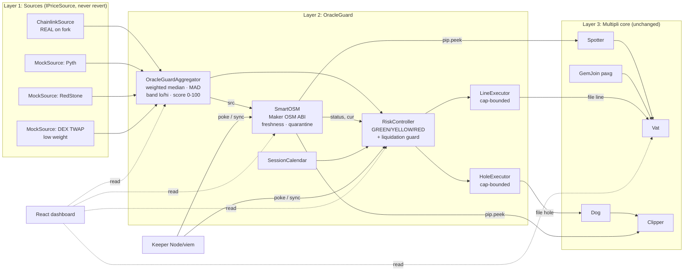
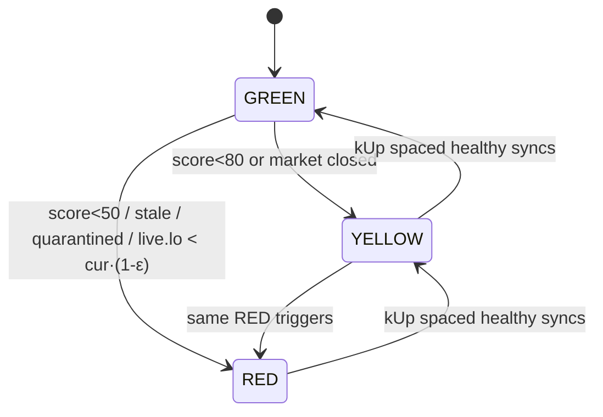

# Architecture

Exact APIs are in `CONTRACTS_SPEC.md`. This file covers the *shape* of the system: layers, flows, the state machine, and the math.

## 1. Before vs after

**Before (deployed rwaUSD):**
```
Chainlink PAXG/USD → PriceFeedAdapter → OSM (1h delay) → Spotter → Vat
                       (0,false) if >24h    ignores false,     has? val : 0
                                            serves cur forever
```
**After (OracleGuard, installed by one spell):**
```
Chainlink ┐
Pyth*     ├→ OracleGuardAggregator → SmartOSM (drop-in pip) → Spotter → Vat
RedStone* │    median·MAD·score        freshness, quarantine,
DEX TWAP* ┘         │                  never 0, atomic spot poke
                    └──────────────→ RiskController ─→ LineExecutor → Vat.line
                                     GREEN/YELLOW/RED ─→ HoleExecutor → Dog.hole
                                     + liq guard   ←── SessionCalendar
(* = MockSource in the hackathon demo, same interface as production)
```

## 2. Component diagram



## 3. Sequence: normal update

```mermaid
sequenceDiagram
  participant K as Keeper (anyone)
  participant O as SmartOSM
  participant A as Aggregator
  participant S as Spotter
  participant V as Vat
  participant R as RiskController
  K->>O: poke()  [after hop]
  O->>A: read()
  A-->>O: Reading{mid, lo, hi, score, ok}
  alt !ok (no quorum)
    O-->>K: PokeSkipped (cur unchanged, age grows → STALE)
  else jump > limit && score < jumpMinScore
    O-->>K: Quarantined (pending, needs re-confirmation)
  else accept
    O->>O: cur = nxt; nxt = mid; lastGoodAt = now
    O->>S: poke(ilk)  (try/catch)
    S->>O: peek() → (cur, true)
    S->>V: file(ilk, "spot", cur/par/mat)
  end
  K->>R: sync(ilk)
  R->>A: read() (live band)
  R->>O: status(), price()
  R->>V: via LineExecutor: file(ilk,"line", …)
  R->>R: liquidation guard on/off via HoleExecutor
```

## 4. Health state machine



| State | `Vat.line` | Liquidations | Repay/deposit |
|---|---|---|---|
| GREEN | `lineCap` (governance value, 1,000,000) | normal | ✅ |
| YELLOW | `min(debt + yellowGap, lineCap)` | normal | ✅ |
| RED | `debt` (no new mint) | normal | ✅ |
| Guard flag (independent) | n/a | `Dog.hole = 0` (no new barks), auto-expires | ✅ |

**Asymmetry:** RED (over-borrow risk) blocks *minting* but keeps *liquidations* running. The guard (unfair-liquidation risk) blocks *liquidations*. Repayment is never blocked.

## 5. Confidence score

```
fresh_i  = ok_i && now - updatedAt_i ≤ maxAge_i
m0       = weightedMedian(fresh prices)
MAD      = median(|p_i − m0|);  inlier_i ⇔ |p_i − m0| ≤ k·max(MAD, m0·floor)
mid      = weightedMedian(inliers); lo = min; hi = max; d = (hi − lo)/mid
Wq = Σ weight(inliers) / Σ weight(all sources)      (each oracle contributes its weight share; review.md §R1)
Wd = max(0, 1 − d / dMax)
a  = age of the FRESHEST inlier (dropouts are already penalised by Wq, disagreement by Wd)
Wf = 1 if a ≤ maxAge/2, else max(0, 1 − (a − maxAge/2)/(maxAge/2))   (grace band, then linear)
score = round(100 · Wq · Wd · Wf);  score = 0 and ok = false if nInliers < quorumMin
```
Defaults (PAXG): weights Chainlink 2 / Pyth 2 / RedStone 2 / DEX 1 (total 7), quorumMin 2, k 3, floor 0.1%, dMax 2%, maxAge 1h for mocks / 25h for Chainlink (its heartbeat is long; see ONCHAIN_FACTS §3).
Thresholds: GREEN ≥ 80, YELLOW 50–79, RED < 50.

Sanity check at the fork block: Chainlink's round is ≈16.5h old but within its 25h maxAge, and the mocks are fresh, so Wq 1 × Wd ≈1 × Wf 1 gives **≈100 → GREEN** (the demo must start GREEN).
Worked example: Chainlink beyond 25h (stale), the other 3 agree: Wq 5/7 × Wd 1 × Wf 1 gives **71 → YELLOW**. DEX outlier only: 6/7 gives **85 → GREEN**. Full contribution table + parity vectors: `review.md` §R1.3–R1.4. Lending continues with tighter headroom ("one stale source doesn't halt lending").

## 6. Deployment spell (impersonated Admin Safe on fork)

```
init SmartOSM from legacy cur → kiss [Spotter, Clipper, End, Controller]
spotter.file("paxg","pip",SmartOSM)
vat.rely(LineExecutor); dog.rely(HoleExecutor); set caps (1,000,000 / 400,000 RAD)
spotter.poke("paxg"); controller.sync("paxg")
Rollback: spotter.file("paxg","pip",LEGACY_OSM); vat.deny/dog.deny executors
```

## 7. Off-chain

- **Keeper** (`keeper/`, Node + viem): every N seconds, advance mocks (demo "market feed"), `poke()` when `pass()`, then `sync()`. In the demo it also exposes scenario commands.
- **Dashboard** (`dashboard/`, React + Vite + viem): reads `deployments/fork.json`. Panels:
  1. Source table (price, age, fresh, inlier)
  2. Confidence gauge + band
  3. State badge + guard flag
  4. Vat line / debt / headroom
  5. Legacy-vs-OracleGuard comparison
  6. Scenario buttons S1–S5
  7. Event log

## 8. Production extensions (designed, not built)

Verifiable challenge window (void `nxt` with signed Pyth/Data-Streams evidence), round-TWAP of Chainlink rounds for `nxt`, Clipper `stopped` executor, PoR-gated minting, a timelock on oracle config, mint-rate limiter, CCIP health broadcast to Base/Ink/Monad, and a native v2 Vat with separate borrow/liquidation prices.
