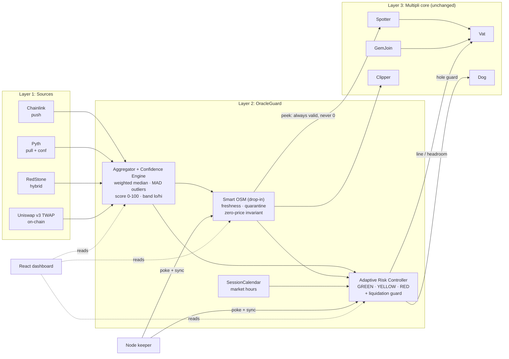

# OracleGuard: Graduated-Trust Oracle Layer for rwaUSD
### Round 2 Design Report · Multipli Hackathon 2026 · "Rethinking Blockchain Oracles"
Team: R Varun · Kapilan · Jeffrey Winson (VIT Vellore)

> Master design reference. Companion docs live in `docs/`; the task board is `PROGRESS.md`; the AI entry point is `CLAUDE.md`.

---

## A. Documentation map

```
multipli/
├─ CLAUDE.md              ← entry point Claude reads first: project summary, doc map, rules
│                           (zero-price invariant, repay-always-works, verified addresses,
│                           ilk = "paxg", coding conventions, "update PROGRESS.md after each task")
├─ README.md              ← public-facing: what OracleGuard is, quickstart, demo commands
├─ PROGRESS.md            ← living task board: 30h plan as checkboxes with hour budgets,
│                           owner (A/B), status, blockers, session log, "next action"
└─ docs/
   ├─ ORACLE_DESIGN.md    ← this full report (master reference)
   ├─ PROBLEM.md          ← problem statement, current pipeline, threat model V1–V13
   ├─ ONCHAIN_FACTS.md    ← every verified address, param, and value + how to re-verify (cast cmds)
   ├─ ARCHITECTURE.md     ← layers, mermaid diagrams, data flow, state machine, score formula, spell
   ├─ CONTRACTS_SPEC.md   ← per contract: purpose, storage, functions (signatures), events,
   │                        custom errors, access control, invariants. Written for building directly
   ├─ SCOPE.md            ← MVP / high-impact / designed-only, cut lines, acceptance criteria per item
   ├─ DEMO_SCRIPT.md      ← S1–S5 step by step (commands, expected on-chain results), 3-min demo flow, fallback plan
   ├─ TESTING.md          ← fork setup (pinned block, RPC), test matrix, invariants, fuzz targets
   ├─ TECH_STACK.md       ← tools + versions + install/setup commands (Windows-friendly)
   ├─ DECISIONS.md        ← ADR log: line-not-mat, Ethereum fork vs Arbitrum, mocks, zero-price invariant, drop-in ABI
   ├─ LIMITATIONS.md      ← honest trade-offs + prepared answers
   └─ PITCH.md            ← deck outline (slide by slide), business model, judge Q&A cheat-sheet
```

## B. Honest assessment: how solid is this plan?

**Verdict: strong enough to win if the demo lands.** Scored against what hackathon judges (here, Multipli's own engineers) reward:

| Dimension | Rating | Why |
|---|---|---|
| Problem understanding | ★★★★★ | We read the real source and on-chain state. Few teams will have the OsmMom finding, the 16.5h-old price observation, or the stale-low direction |
| Feasibility with the real system | ★★★★★ | **Verified today: the admin Safe is a `ward` on Vat, Spotter, Dog, Clipper, and Join**, so impersonating it on a fork makes the spell fully executable. PAXG-A live params: `ilk="paxg"`, **`mat = 1.40`** (matches our Round 1 140%), `line = $1M`, debt ≈ $43k, `Line = $5M`, `Dog.hole = $400k`, `chop = 1.05`, `buf = 1.10`, `dust = $200` |
| Innovation | ★★★★☆ | Graduated trust + confidence score + asymmetric safety + zero-price invariant is a coherent, defensible story. Not revolutionary crypto, but correct for the sponsor, which matters more |
| 30h execution risk | ★★★☆☆ (**the main risk**) | Estimate ≈32h against a 30h budget. The critical path is contracts + fork tests (hours 0–20). Mitigations below |
| Pitch / continuity | ★★★★★ | Same OracleGuard as Round 1. The `mat` correction shows rigor rather than weakness |

**Top risks and mitigations (built into SCOPE.md / PROGRESS.md):**
1. **Time overrun:** hard cut lines. By hour 12, S1 baseline + Aggregator + SmartOSM must be done, or drop SessionCalendar/TSLAx. By hour 20, S1–S4 green, or drop the keeper and simplify the dashboard.
2. **Fork flakiness:** use a free Alchemy/Infura key and **pin a fork block** for deterministic tests. Keep an `anvil --fork-block-number` state dump for the demo.
3. **Dashboard not ready:** fallback is a CLI scenario runner (`forge script` with colored console output) plus a pre-recorded video. The demo never depends on the UI alone.
4. **PAXG fee-on-transfer / Join quirks:** tests use `deal()` + the real `GemJoin` first. If that fails, fall back to `vat.slip` via the impersonated Safe (it is a Vat ward).
5. **Judge question "why not just make OSM invalidate stale prices?"** Prepared answer: the zero-price trap (V4). Invalidating means `spot=0`, which liquidates everyone. That is exactly why graduated trust is needed.
6. **Judge question "your sources are mocked"**: Chainlink is real on the fork. The others are mocked *on purpose*, for attack injection, behind a production interface. Say so upfront.

**One upgrade that makes it much stronger (recommended, ~1h):** make S1 a **dollar-denominated "killer moment"** using the real params. Show the attacker's minted rwaUSD vs the true collateral value, e.g. "minted $X against $Y of real collateral → $Z bad debt on the live protocol", then the identical transaction reverting with `Vat/ceiling-exceeded` after the spell.

---

## 0. TL;DR (the 30-second pitch)

rwaUSD prices collateral through **Chainlink PAXG/USD → `PriceFeedAdapter` → Maker `OSM` (1h delay) → `Spotter` → `Vat`**. We read the **verified source and live mainnet state** of every one of these contracts. The core flaw: the pipeline can only say **"here is a price"** or **"price is zero"**, and zero liquidates every vault. So the OSM **silently drops the adapter's staleness signal and keeps serving an old price as valid, with no time limit.** The only emergency lever deployed (`OsmMom.stop()`) *freezes* that stale price instead of rejecting it.

**OracleGuard** (continuing our Round 1 idea) replaces this binary oracle with **graduated trust**:

1. **Multi-Oracle Aggregation + Confidence Score (0–100):** Chainlink (push), Pyth (pull), RedStone (hybrid), and a Uniswap v3 TWAP are combined with a weighted median and outlier rejection, giving a price, a confidence band, and a score.
2. **Smart OSM:** a *drop-in* replacement for the Maker OSM (same ABI, so Spotter/Clipper/End don't change). It propagates staleness per asset, holds back suspicious jumps, and **never feeds a zero into the Vat**.
3. **Adaptive Risk Controller (GREEN / YELLOW / RED):** maps confidence to **tightening moves on levers Maker already exposes** (debt ceiling, mint headroom, liquidation guard). **Repayments always work; only new borrowing is restricted.**
4. **Asymmetric safety:** *borrow at the worst plausible price, liquidate only at a confirmed price.* This protects both directions, over-borrowing on stale-high prices **and** unfair liquidations on stale-low prices.
5. **RWA-native:** per-asset freshness and a market-hours regime (weekend-gap handling for tokenized equities like TSLAx).

**Demo:** fork Ethereum mainnet, show the stale-price exploit **succeeding on the real rwaUSD contracts**, run one governance "spell" that installs OracleGuard, and show the same attacks failing, with a live React dashboard.

---

## 1. Round 1 → Round 2: what we kept, what we sharpened

| Round 1 (submitted idea) | Round 2 (this build) | Why the change |
|---|---|---|
| OracleGuard name, 3 features, 3-layer diagram | **Kept, same name, same 3 layers, same 3 features** | Continuity for judges |
| Confidence score 0–100 from Chainlink/Pyth/RedStone/DEX TWAP | **Kept, now with an exact formula** (§5.3) | Makes the score auditable |
| GREEN/YELLOW/RED graduated response | **Kept**, plus a **liquidation guard** flag for the stale-*low* direction | Covers the failure direction nobody else covers |
| YELLOW: `mat` raised to 160–200% | **Refined: YELLOW tightens *new borrowing* via debt-ceiling headroom and mint-rate limits, not `Spotter.mat`** | ⚠️ In a Maker fork, `mat` is also the **liquidation** ratio. Raising it from 140% to 180% during an oracle incident instantly makes every vault between 140–180% liquidatable, which breaks our own rule "only new borrowing is restricted". We found this in the Phase 1 code review. The *effective* borrow ratio for new debt still rises. The native v2 path (§9) supports a true separate borrow-CR. |
| RED: `line = 0` | **`line = current debt`** (same effect: no new debt, repay works). Also: RED never touches the price, so no zero-price cascade | `line = 0` works too, but pinning to current debt lets auto-recovery restore it cleanly |
| Smart OSM "propagates staleness" | **Kept, now specified**: freshness tracking, zero-price invariant, jump quarantine, keeper bounty, atomic Spotter poke | |
| Arbitrum One | **Demo on an Ethereum mainnet fork** (rwaUSD's core lives on Ethereum). The design is chain-agnostic; on L2s like Arbitrum, add the Chainlink Sequencer Uptime check | Attacking and fixing the **real deployed contracts** is far more convincing than a fresh deploy |
| React dashboard, Node keeper, Foundry | **Kept** | |
| Business model | **Kept and expanded** (§11) | |

**Claims to double-check before the final deck:** "13% of DeFi exploits in 2025 were oracle attacks" (find and cite the source, or soften to "oracle manipulation is consistently among the top DeFi exploit classes"). Also "first system built specifically for RWA oracles": Multipli's own docs describe a v2 oracle design, and there is concurrent public work (`aso-sentinel`). Prefer **"first graduated-trust oracle layer that drops into rwaUSD's deployed Maker-fork contracts without core changes."**

---

## 2. What exists today: the verified current system

### 2.1 Contracts (Ethereum mainnet, all verified by us on 2026-09-19 via source + `eth_call` + event logs)

| Component | Address | Verified facts |
|---|---|---|
| rwaUSD | `0x8Fcd23142047A3073ed332a0Ed07d1e8D2BD5177` | Also on Base, Ink, Monad via CCIP |
| Vat | `0xbC22e8C15bC476EF4FD0124c5A03b23607e30D2C` | One `spot` per ilk, used for **both** mint and liquidation. No notion of price age |
| Spotter | `0xf3aee748355bb07CBe702B4ff8dBE6118b34e2A2` | `spot = has ? val·1e9/par/mat : 0` |
| **OSM** | `0x89fbAe0302b8790D55fa36E6Ab09ac93F865993a` | Stock Maker `osm.sol` (0.6.12). `hop = 3600` (source default 1800, so `step()` was called at block 25,043,242). Readers (`bud`) = Spotter, Clipper, End |
| **PriceFeedAdapter** | `0x82F5790Bd1c96790E4c3a3ebC8142bD4D6F8b1CD` | Custom 0.6.12. `maxDelay = 86400` (24h). Reads Chainlink `0x9944…F8C3`, `description()="PAXG / USD"`, 8 decimals. Aggregator bounds `minAnswer=1`, `maxAnswer≈2^176` (no effective clamp) |
| OsmMom | `0x58b3…621a` | Maker `OsmMom`, OSM ward, can **only** `stop()` the OSM (which freezes `cur`, still `has=true`) |
| Admin Safe | `0x194E…3b99` | **4-of-8 Gnosis Safe**: adapter owner + OSM ward. **No timelock** in front of `setPriceFeed` / `OSM.change` |
| Dog / Clipper(PAXG) / Vow / End | `0x15a3…dDD` / `0x62B7…78F4` / `0x7815…A611` / `0x0267…4BF5` | Clipper uses `pip.peek()` for auction start price |

**Live freshness observation:** the latest Chainlink round had `updatedAt = 1789749023`, and the OSM's last poke boundary was `zzz = 1789808400`. **The "fresh" price the OSM captured was already ≈16.5h old.** This is a deviation-triggered feed with a long heartbeat, and `maxDelay = 24h` leaves almost no buffer.

### 2.2 Price flow (from verified source)

```
Chainlink PAXG/USD ──latestRoundData()──► PriceFeedAdapter.peek()
   (price·1e18/1e8, true)   or   (0,false) if paused | answer<=0 | age > 24h
                                  │
OSM.poke()  [permissionless, once per hour]
   (wut, ok) = src.peek();
   if (ok) { cur = nxt; nxt = wut; zzz = now - now%hop; }
   // !ok → NOTHING happens: no event, no age, cur keeps has=1
                                  │
OSM.peek() → (cur, has==1)        // never checks age
                                  │
Spotter.poke(ilk) → Vat.spot      // separate permissionless call
Clipper.kick/redo → pip.peek() → auction start price
```

### 2.3 Prior art (cite it; it makes us look rigorous)

- **Multipli docs (v2 intent):** `PriceRouter`, `SignedFeedVerifier`, `PriceGuards`, statuses `OK/STALE/DISPUTED/HALTED`. **Not what is deployed.** OracleGuard is a concrete, Maker-compatible implementation of that intent, plus asymmetric safety, confidence scoring, and market-hours regimes.
- **`aso-sentinel`** (concurrent public work): found the same stale-acceptance bug, and uses signed attestations plus a `line=0` breaker. That is one lever and one failure direction. **"Others patched the symptom at the debt ceiling. We fix the oracle itself *and* use the ceiling."**

---

## 3. Threat model (attack vectors on the deployed OSM + adapter)

| # | Vector | Where | Mechanism → Impact | Sev |
|---|---|---|---|---|
| V1 | **Unbounded stale acceptance** | `OSM.poke()` `if (ok)`, `OSM.peek()` | Adapter says stale, OSM ignores it and keeps serving `cur` with `has=true` **forever**. If nobody pokes, same result. **Max price age is unbounded.** | **Critical** |
| V2 | **Stale-high over-borrowing** | V1 + `Vat.frob` | Market falls while spot stays high: buy cheap collateral, mint at the stale price, walk away. Bad debt | High |
| V3 | **Stale-low unfair liquidation** *(uncovered by others)* | V1 + `Dog.bark` + `Clipper.kick` | Feed stuck low while the market recovered: healthy vaults are liquidated, and auctions start below market. User losses | High |
| V4 | **Zero-price trap** | `Spotter.poke`: `has ? … : 0` | Invalidating the price makes `spot=0` and every vault liquidatable, so the protocol has no safe "off" switch | High (design) |
| V5 | **Admin key / no timelock** | `setPriceFeed`, `setMaxDelay`, `pause`, `OSM.change/step/void` (4/8 Safe) | 4 signers can point the oracle at an attacker feed. The only delay is the 1h hop, and the only automated reaction (`OsmMom.stop`) freezes the current price instead of rejecting the bad one | High (gov) |
| V6 | **Single source** | Adapter reads one aggregator | No second opinion, no divergence check | Med-High |
| V7 | **Latent clamp risk** | Adapter never checks `minAnswer/maxAnswer` | No effective clamp today (bounds 1 / 2^176), but a future feed swap could report clamped values silently (the LUNA/Venus 2022 class) | Low |
| V8 | **Poke-timing cherry-pick** | Permissionless `poke()` | The first poker in each hour chooses which instant's price becomes `nxt`, locked in for 2h | Low-Med |
| V9 | **Public next-price foresight** | `nxt` in public storage | Everyone sees spot's next value an hour early (MEV around liquidations) | Low-Med |
| V10 | **Heartbeat / maxDelay mismatch** | `maxDelay=24h` vs a long heartbeat | Captured price was already 16.5h old. Effective age reaches ≈26h before any signal, and the signal is ignored anyway | Medium |
| V11 | **One hop for all RWAs** | Same OSM design for gold, equities, T-bills | Tokenized equities trade 24/7 while NYSE is closed: weekend gaps cause bad debt | Medium (grows) |
| V12 | **Two-step propagation** | OSM.poke and Spotter.poke are separate | Extra, unincentivised latency | Low-Med |
| V13 | **Reserve / issuer risk not priced** | No PoR in the price path | Minting continues against impaired collateral | Medium |

**Headline:** *"The deployed rwaUSD oracle has no upper bound on the age of the price it trusts, and its only emergency brake liquidates everyone. OracleGuard turns a two-state oracle, 'trust blindly' or 'self-destruct', into a graded one."*

---

## 4. Design principles

1. **Zero-price invariant:** after init, Smart OSM `peek()` **always** returns `has=true` and a non-zero price. Health travels as a separate signal and acts only through non-price levers.
2. **Repayments always work. Only new borrowing is restricted.** (Round 1 rule, now enforced by invariant tests.)
3. **Asymmetry:** borrowing faces the pessimistic view, liquidation needs agreement.
4. **Graduated, with hysteresis:** downgrade immediately, upgrade only after k healthy updates.
5. **Bounded authority:** automation can only *tighten*, and only within governance caps.
6. **Drop-in:** same OSM ABI, one spell, one-call rollback, no core changes.
7. **Per-asset:** freshness, jump limits, and session rules configured per collateral.

---

## 5. OracleGuard architecture

### 5.1 Overview (matches the Round 1 diagram layers)



### 5.2 Layer 1: Source adapters (`IPriceSource`, never revert)

```solidity
struct Observation { uint256 price; uint256 conf; uint64 updatedAt; bool ok; }
interface IPriceSource { function observe() external view returns (Observation memory); }
```

| Source | Real/Mock in 30h MVP | Hardening |
|---|---|---|
| **ChainlinkSource** | **Real** (PAXG/USD on the fork) | Per-feed staleness, `answer>0`, **min/max clamp check** (V7), `try/catch` |
| **PythSource** | Real if time allows (Hermes update on fork), else **scenario-controllable mock** | Uses Pyth's native confidence interval; `publishTime` staleness |
| **RedStoneSource** | **Scenario-controllable mock** implementing the same interface | Production: RedStone pull-model signed packages |
| **DexTwapSource** | Mock (optionally real Uniswap v3 PAXG/WETH × ETH/USD) | Low weight, ignored below a liquidity floor (thin RWA pools are manipulable) |

> Mocks are *deliberate*: attack scenarios need controllable sources. The **real Chainlink read on a mainnet fork** proves the integration works.

### 5.3 Layer 2a: Aggregator + Confidence Engine

1. Keep sources with `ok` that are fresh (per-source `maxAge`).
2. Weighted median `m`. MAD outlier rejection (drop |pᵢ−m| > 3·max(MAD, floor)), then recompute `m`.
3. Band: `lo = min(inliers)`, `hi = max(inliers)`; dispersion `d = (hi−lo)/m`.
4. **Confidence score (0–100):**

```
score = 100 × W_q × W_d × W_f
  W_q (quorum)    = min(1, n_ok_inliers / N_expected)                 // sources alive & agreeing
  W_d (dispersion)= max(0, 1 − d / d_max)                             // d_max e.g. 2% for gold
  W_f (freshness) = 1 while freshest inlier ≤ maxAge/2, then linear → 0   // see DECISIONS ADR-009
Hard overrides → score = 0: n_ok_inliers < quorumMin, or all sources stale
```

Example: 4 sources, 3 agree within 0.2%, 1 stale gives W_q=0.75, W_d≈0.9, W_f=1, **score ≈ 68 → YELLOW** (not a halt: "one source going stale doesn't halt lending if the others agree", the Round 1 promise).

### 5.4 Layer 2b: Smart OSM (drop-in for `OSM`)

Same external ABI as Maker's OSM (`peek, peep, read, poke, kiss, diss, rely, deny, stop, start, change, step, void, pass, hop, zzz, src, bud, wards`), so Spotter, Clipper, and End keep working unchanged.

| Feature | Behaviour | Fixes |
|---|---|---|
| Freshness | `lastGoodAt`, `age()`, `status()`, `score()` exported | V1, V10 |
| **Zero-price invariant** | `peek()` returns `(cur, true)` once initialised, even when stale. `void()` restricted to the timelock, and only for global settlement | V4 |
| Multi-source input | `src` = Aggregator median (not one feed) | V6 |
| **Jump quarantine** | If \|nxt/cur−1\| > `jumpLimit[asset]` **and** the score is below threshold, `nxt` is held and only promoted after re-confirmation next hop. Large moves with **full agreement pass immediately** (real crashes must still liquidate) | V5, V6 |
| Keeper bounty + atomic Spotter poke | `poke()` also calls `Spotter.poke(ilk)` and pays a small bounty | V12, liveness |
| Per-asset hop | gold 1h, equities 1h + session logic | V11 |
| *(Design, stretch)* Challenge window | During the hop, anyone can void `nxt` by submitting on-chain-verifiable signed prices (Pyth VAA / EIP-712 quorum) | V5, V8 |
| *(Design, stretch)* Round-TWAP | `nxt` = TWAP of Chainlink rounds in the hop, so there is no poke cherry-pick | V8 |

### 5.5 Layer 2c: Adaptive Risk Controller (GREEN / YELLOW / RED)

Permissionless `sync(ilk)` reads the score, band, Smart OSM status, and session, then applies:

| State | Trigger | New borrowing | Liquidations | Repay / deposit |
|---|---|---|---|---|
| 🟢 **GREEN** | score ≥ 80 **and** `live.lo ≥ spot·(1−ε)` | normal: `line = min(debt + gap, cap)`, rate-limited | normal | ✅ always |
| 🟡 **YELLOW** | 50 ≤ score < 80, **or** market closed (equities), **or** age > ½·staleLimit | **tightened**: headroom cut to a small gap budget plus a lower mint-rate cap. The effective CR required for new debt rises; existing vaults are untouched | normal | ✅ always |
| 🔴 **RED** | score < 50, stale beyond limit, quorum lost, **or live market < OSM spot by > ε** (over-borrow window, V2) | **frozen**: `line = current debt` (reverts `Vat/ceiling-exceeded`) | normal (a real crash must still liquidate) | ✅ always |
| 🛡️ **Liquidation guard** (flag, any state) | live `hi` > OSM spot by > ε′ with high agreement (**stale-low**, V3) | frozen | **paused for this ilk**: `Dog.hole = 0` (no new barks), auto-expires after T_max | ✅ always |

- Hysteresis: downgrade instantly, upgrade after k consecutive healthy syncs.
- Executors are tiny contracts that can each write **one parameter** within `[0, cap]` (Maker `DssAutoLine` / `ClipperMom` / `OsmMom` pattern).
- **Why not raise `mat`:** in the Maker Vat, `mat` sets both borrow *and* liquidation thresholds (§1). The debt-ceiling lever restricts only new debt.

### 5.6 SessionCalendar (RWA market hours)

Weekly UTC session bitmap per asset (NYSE for TSLAx; gold ~23h × 5d). Closed means at least YELLOW. On reopen, borrowing stays tightened until 2 fresh full-agreement updates, **while liquidations run normally** so gap-downs are processed.

### 5.7 Off-chain: Node keeper + React dashboard

- **Keeper (Node + viem):** calls `SmartOSM.poke()` and `Controller.sync()` on schedule and whenever the score changes. In production: Chainlink Automation / Gelato.
- **Dashboard (React + Vite + wagmi/viem + Recharts):** live sources, band, **confidence gauge**, state badge, Vat `line`, debt and headroom, event log, and **attack-scenario buttons** that drive the mock sources and warp time on the fork. Side-by-side "Legacy OSM vs OracleGuard".

### 5.8 Deployment: one spell, no core changes

```
1. Deploy sources, Aggregator, SmartOSM("paxg"), SessionCalendar, Controller, executors.
2. SmartOSM.kiss([Spotter, Clipper, End]); prime cur/nxt from the legacy OSM value (no discontinuity).
3. Spotter.file("paxg","pip",SmartOSM)            // real ilk name on-chain is "paxg"
4. Vat.rely(LineExecutor); Dog.rely(HoleExecutor)   // each writes exactly one bounded param
5. Spotter.poke("paxg")
Rollback: Spotter.file("paxg","pip",legacyOSM)
(All executed by impersonating the admin Safe, which is verified as a ward on Vat/Spotter/Dog/Clipper/Join.)
```

Governance recommendation (for the deck, not built): put a 48h timelock between the Safe and oracle configuration, and give the guardian tighten-only powers (V5).

---

## 6. Mapping to the brief's five failure classes

| Failure class | OracleGuard answer |
|---|---|
| Latency | Keeper bounty + atomic OSM→Spotter poke. Borrowing reacts to the *live* band immediately, while liquidations keep the manipulation-resistant delay |
| Manipulation | Weighted median + MAD across 4 networks, low-weight DEX with liquidity floor, jump quarantine, (stretch) verifiable challenge window |
| Stale data | Per-asset freshness, `age()`, stale → RED, **bounded exposure** |
| Source failure | Quorum with graceful degradation: one bad source gives YELLOW, not a halt. Adapters never revert |
| Data availability | Pull oracles (Pyth/RedStone) can be pushed on-chain by any user in the same tx |

---

## 7. Risk math (numbers for the slide)

Delay risk: buffer needed ≥ z·σ·√L, with z=4.

| Collateral | σ (annual, approx.) | Exposure window | Buffer needed | Takeaway |
|---|---|---|---|---|
| PAXG | ~15% | 2h | ~0.9% | 1h OSM delay is fine for gold; **unbounded staleness (V1) is the real risk** |
| TSLAx (open market) | ~60% | 2h | ~3.6% | OK with an equity-specific ratio |
| TSLAx (weekend gap) | ~3.8%/trading day | 1 day-equivalent | **~15%** | Borrowing must tighten while the market is closed |

**Loss bound:** `MaxLoss ≤ mintRateCap × detectionTime`. For example, $250k/h × 2h = **≤$500k worst case vs unbounded today.**
**Capital efficiency (Round 1 claim, now justified):** because OracleGuard *reacts* to oracle health, the base ratio can stay efficient (e.g. 140%) instead of padding a static 200% buffer for rare oracle failures. Only new borrowing tightens, and only while trust is degraded.

---

## 8. 30-hour MVP build plan (solo/duo) — **my recommendation**

**Strategy:** build the one demo path end to end (real contracts, exploit, fix, dashboard) and present the rest as designed but not built. Judges reward a working demo on the real protocol far more than breadth.

### 8.1 Build (in order; hours are estimates)

| # | Deliverable | Hours | Priority |
|---|---|---|---|
| 1 | Foundry scaffold + mainnet-fork harness + minimal interfaces (Vat, Spotter, Dog, OSM, adapter, GemJoin). **Baseline exploit test S1 passing on the real rwaUSD contracts** | 3 | 🔴 must |
| 2 | `IPriceSource`, `ChainlinkSource` (real), `MockSource` (Pyth/RedStone/TWAP stand-ins) | 2 | 🔴 must |
| 3 | `OracleGuardAggregator` (median, MAD, band, score) + unit/fuzz tests | 4 | 🔴 must |
| 4 | `SmartOSM` (ABI-compatible, freshness, zero-price invariant, quarantine, atomic Spotter poke) | 4 | 🔴 must |
| 5 | `RiskController` (GREEN/YELLOW/RED + liquidation guard) + `LineExecutor` + `HoleExecutor` | 3 | 🔴 must |
| 6 | `Spell.s.sol` + fork tests **S1–S4** (baseline ❌ / OracleGuard ✅) + invariants (repay always works, spot never 0) | 4 | 🔴 must |
| 7 | `SessionCalendar` + simulated **TSLAx** profile + scenario S5 | 2 | 🟡 high impact |
| 8 | Demo orchestration: anvil fork + deploy script + scenario scripts (warp, set mock prices) | 2 | 🔴 must |
| 9 | React dashboard (gauge, sources, state, line/debt, scenario buttons, before/after) | 5 | 🔴 must |
| 10 | Node keeper (poke + sync loop) | 1 | 🟡 |
| 11 | README + architecture diagram + deck + 2–3 min demo video | 2 | 🔴 must |
| — | **Total ≈ 32h** → cut #10 or trim #9 if behind; items 1–6 are the critical path | | |

**Duo split:** Person A = contracts + fork tests (1–8). Person B = dashboard + keeper + deck (9–11), starting against ABI stubs from hour 4.

### 8.2 Demo scenarios

| # | Scenario | Legacy rwaUSD | OracleGuard |
|---|---|---|---|
| S1 | Chainlink silent for 25h | OSM serves the old price, attacker mints | Stale → RED, mint reverts, repay works |
| S2 | Market −8% while OSM lags | Mint at the stale-high spot | `live.lo < spot` → RED instantly, liquidations continue |
| S3 | One source manipulated / admin swaps the feed | Bad price promoted in ≤2h | Outlier rejected, score drops, quarantine, no promotion |
| S4 | Feed stuck **low**, market recovered | Healthy vaults liquidated | Liquidation guard: `hole` paused, auto-resume |
| S5 | TSLAx weekend gap (simulated) | Full borrowing all weekend, Monday bad debt | YELLOW headroom while closed, cautious reopen |

### 8.3 Designed, not built (in the deck as "Round 3 / production roadmap")

Verifiable challenge window (Pyth VAA / Data Streams evidence), round-TWAP poke, Clipper `stopped` lever, PoR-gated minting, 48h timelock hardening, Python backtest, CCIP status broadcast to Base/Ink/Monad, zkTLS NAV attestations for T-bills, and a native v2 Vat with separate borrow/liquidation prices.

### 8.4 Tech stack (final)

| Layer | Choice |
|---|---|
| Contracts | Solidity 0.8.24, Foundry (forge/anvil/cast), OpenZeppelin, Chainlink + Pyth interfaces |
| Chain for demo | **Ethereum mainnet fork (anvil)**, real rwaUSD contracts, impersonating the admin Safe for the spell. Optional shared Tenderly Virtual TestNet |
| Keeper | Node 20 + TypeScript + viem |
| Frontend | React + Vite + viem + Tailwind + Recharts (wallet connect optional, see DECISIONS ADR-010) |
| Target chains (pitch) | Ethereum (rwaUSD core), portable to Base/Ink/Monad/Arbitrum (+ sequencer uptime check on L2s) |

### 8.5 Repo layout

```
multipli/
├─ ORACLE_DESIGN.md
├─ contracts/  src/{sources/*, OracleGuardAggregator, SmartOSM, RiskController, SessionCalendar, executors/*}.sol
│              script/{Deploy,Spell,Scenarios}.s.sol
│              test/{fork/Baseline*, fork/OracleGuard*, unit/*, invariant/*}
├─ keeper/     (Node + viem)
└─ dashboard/  (React + Vite)
```

---

## 9. Limitations (honest trade-offs)

1. **One `spot` in the Vat.** True separate borrow/liquidation prices need a v2 Vat. We get asymmetric *behaviour* via levers (debt ceiling vs liquidation guard).
2. **Pausing liquidations is risky if prolonged.** Mitigated by requiring high agreement to trigger, plus a T_max auto-expiry.
3. **Oracle independence is imperfect.** Networks share CEX venues. The median protects against *oracle* failure, not a genuine *market* dislocation.
4. **RWA DEX liquidity is thin.** The TWAP is sanity-only.
5. **Mocked sources in the demo** (Pyth/RedStone/TWAP) for scenario control. Chainlink is real.
6. **Extra gas** (~100–150k per poke vs ~40k) and a larger audit surface. Executors are kept minimal.
7. **Parameters** (thresholds, ε, rate caps) need calibration with real data.
8. **Governance:** the admin-key risk (V5) needs Multipli to adopt a timelock. Code alone can't fix it.
9. **Fork demo ≠ production**: an audit and Multipli governance approval are required.

---

## 10. Why this wins

| Criterion | Evidence |
|---|---|
| Depth | Verified source, on-chain state, and event logs. 13 vectors, including stale-low liquidation, no-timelock admin, and the OsmMom-freezes-stale-price finding |
| Innovation | Graduated trust with a formal confidence score, a zero-price invariant, and "borrow at worst, liquidate at confirmed" |
| Practicality | Drop-in OSM ABI, one spell, one-call rollback, Maker-native executor pattern |
| Demo | The exploit succeeds on the **real** rwaUSD contracts, then fails after the spell, with a live dashboard |
| Continuity | Same OracleGuard product as Round 1, refined by the code deep-dive (the `mat` catch shows rigor) |

---

## 11. Business model (from Round 1, expanded)

- **Who:** RWA lending protocols and Maker-fork CDP systems (Multipli, other RWA stablecoins) holding assets with mixed trading hours and liquidity.
- **Revenue:**
  - Integration license: **$5K–$25K per protocol** (setup, per-asset parameter calibration, spell authoring).
  - Per-query fee on pull-model reads (integrators reading `score()`/`status()` as a health API).
  - Keeper incentive spread: a small slice of the stability fee funds poke/sync bounties, so the system is self-sustaining.
  - Upsell: risk-parameter calibration and monitoring (a SaaS dashboard plus alerts).
- **Impact:** closes the stale-price exploit window; better capital efficiency (140% base instead of static 200% padding); no single oracle failure halts lending across 100+ RWA assets; worst-case oracle loss becomes bounded and quantifiable.

---

## 12. Open questions for the Multipli team

1. Current PAXG-A parameters (`mat`, `line`, `dust`, `Dog.hole`, Clipper `buf/tail/cusp`), and is AutoLine/ClipperMom deployed?
2. Who pokes the OSM and Spotter today, and how often?
3. The assumed PAXG/USD heartbeat behind `maxDelay = 24h`?
4. Next collateral types (xStocks, T-bills), and will they share this oracle pattern?
5. Would they adopt a timelock for oracle configuration?

---

## 13. Verification (Phase 2)

- `forge test --fork-url $ETH_RPC_URL`: baseline tests show the exploits working on unmodified contracts, and OracleGuard tests show them blocked after `Spell.s.sol`.
- Invariants: `spot > 0`; repay never reverts due to the oracle; the controller never sets `line > cap`; `peek()` is never `has=false` after init.
- Fuzz: aggregator with random prices, outliers, and staleness.
- Manual: run anvil fork + deploy + dashboard, click through S1–S5, and confirm the state, `line`, and revert messages on-chain.

### Sources
- Verified contracts / state: Blockscout + public Ethereum RPC (OSM `0x89fb…993a`, adapter `0x82F5…b1CD`, OsmMom `0x58b3…621a`, Safe `0x194E…3b99`)
- [Multipli docs](https://docs.multipli.fi/) · [aso-sentinel](https://github.com/AnantSharmaDev768/aso-sentinel) · [Chainlink × rwaUSD](https://www.tronweekly.com/chainlink-powers-340m-rwausd-stablecoin-with-3/)
